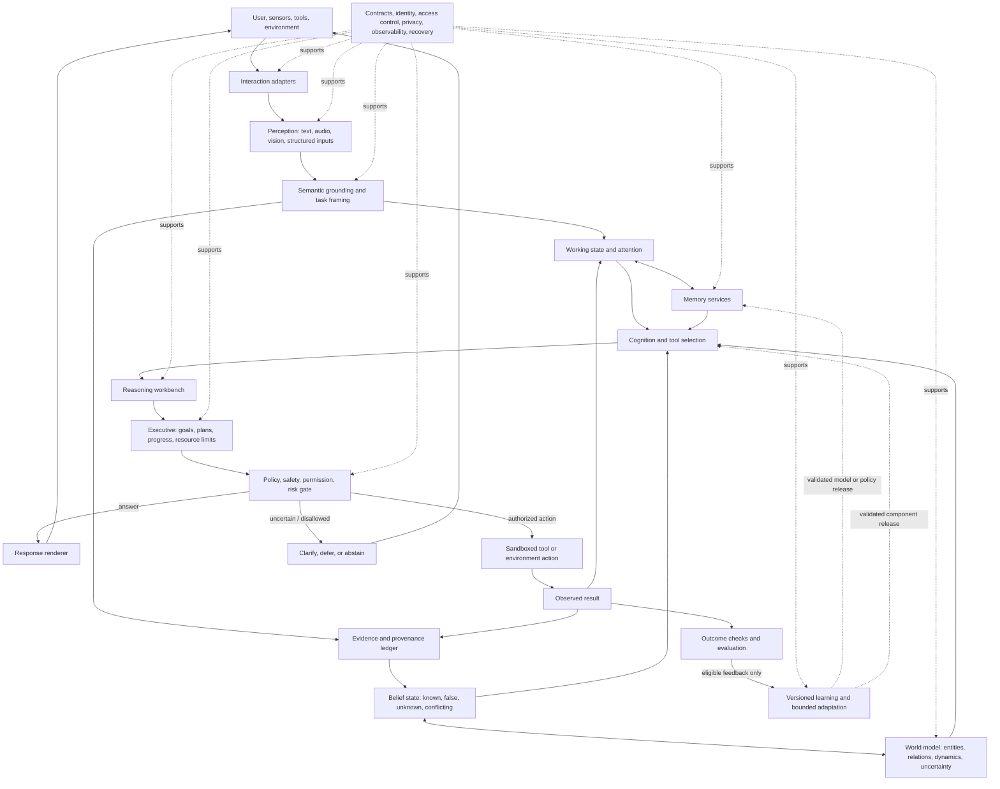

# A complete engineered-intelligence architecture

An engineered intelligence should be designed as a system that can **perceive, interpret, remember, reason, plan, act, learn from checked outcomes, and recognize when it does not know**. No single solver or neural model supplies all of those abilities. The design below combines learned perception and language capabilities with explicit evidence, structured state, specialist reasoning tools, controlled actions, and measurable feedback.

This is a **proposed target architecture**, not a description of what the current XAI runtime already does. It is intended to make a capable general-purpose assistant or agent, with its actual competence defined by evaluated tasks. It does not assume consciousness, human-like experience, or general intelligence merely because the modules are present.

## Architecture at a glance

The key design choice is a shared, versioned **cognitive state**. Perception proposes structured interpretations; grounding records what is known and how it is known; reasoning and planning work from that state; a policy gate constrains actions; and verified results update memory or learning only under declared rules.

The architecture has these cooperating layers:

1. **Interaction and environment adapters** receive text, speech, images, video, structured records, and tool results, and deliver text, speech, images, or authorized actions.
2. **Perception and representation** turn each input into task-relevant representations while preserving uncertainty and links to the original.
3. **Semantic grounding** converts candidate interpretations into typed claims, entities, events, relations, units, time references, and task constraints. Ambiguity remains explicit instead of being silently guessed away.
4. **Cognitive state and memory** maintain the current task, evidence ledger, beliefs, conversation context, past episodes, learned semantic knowledge, and reusable procedures.
5. **World model** predicts how relevant parts of the environment may change and keeps observations separate from forecasts and assumptions.
6. **Cognition and reasoning** choose and combine learned-model inference, retrieval, symbolic logic, probability, causal analysis, search, mathematical tools, and code execution according to the task.
7. **Executive control** chooses goals and subgoals, plans bounded work, tracks progress and resources, and revises a plan when evidence or outcomes change.
8. **Metacognition and decision policy** estimate uncertainty, capability, and failure risk; choose among answering, asking, abstaining, or acting; and apply safety and authorization checks.
9. **Learning and adaptation** improve representations and strategies from eligible data and feedback through versioned, tested, reversible updates—not uncontrolled self-modification.
10. **Platform services** provide typed interfaces, identity and access control, provenance, storage, execution isolation, telemetry, and recovery across all layers.

## The end-to-end loop

A request does not have to pass through every reasoning engine. The executive selects the minimum suitable path and records which components ran, were skipped, or failed. A language question may need retrieval and a language model; a formal weighted-CNF problem may go directly to the exact solver; a physical action additionally needs capability checks, authorization, and outcome monitoring.

## What each component does

### 1. Interaction and environment adapters

Adapters normalize incoming and outgoing modalities without claiming to understand them. They preserve the original input or a protected reference to it, timestamps, source identity where available, locale, modality, and transformation versions. Adapters also make tool APIs look like typed actions and typed observations rather than arbitrary text commands.

The adapter should reject malformed or unsupported inputs explicitly. It should not silently discard material spans, convert units without recording the conversion, or treat a transcript or OCR result as certain merely because it is syntactically valid.

### 2. Perception and representation

Task-specific encoders process language, speech, images, video, and other supported signals. A learned foundation model may be used for language understanding, generation, recognition, and proposing candidate interpretations; specialist vision, speech, or structured parsers may supply other representations. Every output carries uncertainty, modality and source references, and the model/version that produced it.

Perception outputs **hypotheses**, not trusted facts. For example, a speech recognizer may return two plausible transcripts; a grounding layer decides whether the distinction matters, preserves alternatives when appropriate, and asks the user when it cannot safely resolve them.

### 3. Semantic grounding and task framing

This layer compiles a perceived request into a typed task record: the user's apparent goal, entities, claims, temporal and spatial references, constraints, requested output, relevant permissions, and unresolved questions. Entity resolution links names and mentions to stable IDs only when evidence supports the match; otherwise it records candidates or `unresolved`.

Extracted claims retain source and observation references, extraction confidence, time, scope, and dependence information. Direct observation, user-provided assertion, retrieved source, model inference, and hypothetical assumption remain distinguishable. The system does not convert absence of a record into evidence that a claim is false unless a declared closed-world rule applies.

### 4. Cognitive state and memory

Memory is a set of services with different jobs, not one undifferentiated text store:

- **Working memory** holds the current task, active subgoals, relevant context, candidate interpretations, constraints, and open questions. It is bounded and task-scoped.
- **Episodic memory** records selected past interactions or actions, their context, outcomes, and provenance, subject to retention and privacy policy.
- **Semantic memory** stores reusable concepts, entities, relations, and sourced claims with time and confidence information.
- **Procedural memory** stores tested skills, plans, tool-use recipes, and their preconditions and known failure modes.
- **Evidence ledger** is append-only at the logical level: updates add corrections or newer observations and link them to prior records rather than erasing history. Duplicate and dependent sources are not naively counted as independent support.

Each stored item has a typed schema, access and retention policy, creation/update provenance, and version. Retrieval returns both relevant material and why it matched. Memory can be partitioned, encrypted, expired, or omitted; memory is not automatically universal or permanent.

### 5. Belief state and world model

The belief state tracks whether a proposition is supported, contradicted, unknown, or unresolved, with uncertainty and evidence lineage. It can combine exact symbolic values, probabilities, intervals, or qualitative confidence when each is justified. The system must label which representation it used and not present a model-generated score as a calibrated probability without validation.

The world model represents entities, relations, states, actions, and transition patterns. It answers bounded predictive questions such as “what is likely to happen if this action is taken?” and supports planning and counterfactual exploration. A prediction or imagined scenario is stored as a forecast with assumptions, not written back as an observed fact. Causal answers require identification assumptions and suitable evidence; observational correlation alone does not establish intervention effects.

### 6. Cognition and reasoning workbench

The reasoning workbench selects specialist methods based on the task's formal contract:

- **Learned inference** interprets language, proposes decompositions, summarizes, and generates candidate explanations or plans. Its outputs can be checked against evidence and constraints.
- **Retrieval** finds relevant memories and external information, returning source references, dates, and scope.
- **Symbolic and constraint reasoning** handles declared facts, rules, temporal relations, consistency, and bounded finite-domain tasks.
- **Probabilistic reasoning** handles uncertainty when the model, dependencies, and numerical assumptions are explicit.
- **Causal reasoning** is allowed only when a causal model and identification assumptions support the query; otherwise the result is `not identified` or `unsupported`.
- **Search and planning** explore alternatives under declared depth, time, and compute limits.
- **Mathematical and program tools** execute computations or code in controlled environments and return outputs that can be independently checked where feasible.

The workbench maintains a trace of inputs, assumptions, tool versions, intermediate claims needed for verification, and results. A trace helps audit the computation; it is not automatically proof that every hidden model inference is correct. Exactness applies only to a formally encoded input and the guarantees of the selected solver.

### 7. Executive control and planning

The executive turns the task into goals, measurable completion conditions, and a bounded sequence of steps. It selects tools and reasoning methods, schedules work, passes only relevant context, enforces time and resource budgets, and monitors expected versus observed progress. It can replan when new evidence arrives, a tool fails, a budget is reached, or assumptions are contradicted.

Plans represent preconditions, predicted effects, costs, reversibility, required permissions, and failure handling. An action is not considered complete merely because a tool call returned success; the executive checks the actual outcome against the intended effect. If a task depends on missing information, it asks a focused clarification instead of choosing an arbitrary interpretation.

### 8. Metacognition, decision, and safe action

Metacognition monitors confidence, evidence quality, memory reliability, tool status, distribution shift, resource use, and whether the task falls within known capability. It must be grounded in measurable signals and evaluated calibration; a narrative “self-assessment” generated by a language model is not a reliable confidence estimate on its own.

For each possible response or action, the decision layer considers expected utility or loss, uncertainty, cost, safety rules, and whether a required verification can be obtained. It chooses one of four high-level outcomes: **answer**, **ask**, **abstain/defer**, or **act**. It explains material assumptions and limitations in user-appropriate language.

Tool execution is permission-scoped and isolated. The policy gate checks the requested operation, tool capability, user authorization, data boundary, and consequences before execution. High-impact or irreversible actions require the appropriate user confirmation. A missing permission, invalid certificate, policy conflict, unsupported input, or failed verification prevents the action; the system reports a useful reason rather than pretending it succeeded.

### 9. Learning, calibration, and bounded adaptation

Learning has distinct data lanes and release controls:

- **Offline training** improves encoders, language models, world models, or policies using declared datasets, split rules, and objectives. Training artifacts include lineage and evaluation results.
- **In-task learning** can update temporary working state, but does not silently mutate the deployed model.
- **Feedback learning** uses outcomes only after their label, source, partition, and eligibility are checked. User corrections may improve task context without automatically becoming globally true facts.
- **Personalization** is scoped to an authorized user or workspace and follows retention, consent, export, and deletion policies.
- **Adaptation** searches a bounded, named set of parameters or strategies against a stated development objective, monitors for regression, and can roll back to a known baseline.
- **Calibration and shift detection** use held-out data distinct from training; they trigger narrowed claims, extra verification, or abstention when their assumptions fail.

No online self-modification is allowed to change core permissions, safety policy, identity, access controls, or evaluation labels. Any deployed model or policy change is versioned, tested, reviewable, and reversible.

### 10. Platform and cross-cutting controls

Every module communicates through versioned typed records. A common result envelope carries status, value, assumptions, provenance IDs, model/code/schema versions, exact-versus-approximate designation, limits, and diagnostics. The platform supplies authentication and authorization, privacy and retention enforcement, secret handling, storage, audit logs, deterministic replay where possible, timeouts, resource limits, retries, circuit breakers, isolation, and recovery.

Observability records what ran, what it consumed, what it produced, and why a path stopped, while minimizing sensitive content in logs. Errors are typed: for example `invalid_input`, `unknown`, `conflicting_evidence`, `unsupported`, `not_identified`, `resource_limit`, `timeout`, `verification_failed`, and `policy_denied`. A failed stage cannot be converted to a successful-looking answer by dropping its status.

## How the existing XAI components fit

The XAI repository supplies valuable formal components for this design, but its own documentation describes a much narrower implemented runtime. Its normal route begins with structured, unprojected DIMACS weighted-CNF; it validates and parses that input, may run bounded adaptation and factual ingestion, invokes exact weighted model counting, then applies a decision gate. It is not currently a connected language-to-action system.

| Existing XAI component | Role in the proposed architecture | What must not be inferred from it |
|---|---|---|
| Factual ingestion | A bounded evidence/belief service; preserve its typed facts, provenance, explicit dependence rules, and exact finite marginals where tractable. | It does not extract facts from ordinary language, resolve entities, judge source trust, or maintain a general world knowledge base. |
| Predictive learning | A task-specific predictor for solver completion; place it among capability/resource estimates. | Its fixed experts and fixture evidence do not constitute broad predictive intelligence or validated general learning. |
| Evolution/adaptation | A narrow example of bounded parameter tuning, change monitoring, and rollback. | It is not open-ended self-improvement; it only adjusts declared solver settings for a bounded objective. |
| Reasoning | A specialist formal reasoning engine for tasks fitting its finite-domain contract; add other solvers behind the same interface. | It is not a general language, causal, or commonsense reasoner. Its causal interface does not estimate causal effects. |
| Calibration | A diagnostics service for predictions when suitable labeled data and assumptions exist. | It does not fit a calibrator or make its input probabilities trustworthy; current checks are not broad deployment calibration. |
| Output/decision | A risk/abstention gate consuming supplied probabilities, costs, and certificate information. | It does not generate or independently prove the results it gates; its certificate checker is not a production proof verifier. |
| Orchestration | A useful typed pipeline pattern: validate, route, trace, bound resources, and emit a versioned result. | It is not a general agent executive; its route handles structured WMC requests, and ordinary language understanding is outside it. |
| Exact WMC solver | A specialist engine called by reasoning when the request is a supported weighted-CNF problem. | Exact counting of the encoded formula does not show the formula correctly represents a real-world question. |

The Python answer-surface-counting training workflow described separately in the repository is not a semantic grounding service or a connected C++ runtime learner. It could be replaced or retained only as a narrowly evaluated retrieval/statistical component with a clear contract and independent testing.

## Core invariants

These rules apply across the system, not only inside individual modules:

- **Evidence is not inference:** observed inputs, extracted claims, model predictions, assumptions, and imagined outcomes have distinct types and labels.
- **Unknown stays unknown:** missing data, unresolved identities, unsupported queries, and failed stages never become confident negatives or positives by default.
- **Provenance follows claims:** users and evaluators can trace material factual claims to their source, time, extraction path, and applicable transformation/model version.
- **Dependencies are explicit:** copied, correlated, or unknown-dependence sources are not counted as independent corroboration.
- **The tool must fit the task:** exact solvers are exact only over their accepted formal inputs; unsupported inputs fail explicitly instead of being silently rewritten.
- **Learning is controlled:** data partitions, update eligibility, parameter bounds, change detection, release tests, and rollback are explicit.
- **Permissions constrain plans:** a goal does not imply permission to use a tool, access data, or take an external action.
- **Verification precedes consequential action:** decision thresholds and required user approvals are enforced at the action boundary.
- **Capability is measured:** module presence is not evidence of capability; claims are limited to evaluated task families and conditions.

## What “complete” means in practice

A complete architecture is a connected path, not a large list of components. For any supported task, a test should be able to follow the chain from original input through interpretation, grounding, memory/retrieval, reasoning, decision, output or action, and outcome check. It should also test the cases where that chain must stop: ambiguous input, conflicting evidence, a failed tool, unsupported reasoning, exhausted limits, shift, missing permission, or a required verification that cannot be established.

The system should be evaluated end to end on task success and error severity, not just unit tests. Depending on its scope, the evaluation should include input interpretation and entity resolution, evidence and provenance fidelity, reasoning correctness, planning success, calibrated selective answers, tool-use success, safe action behavior, latency and resource limits, and robustness to ambiguity, contradiction, dependence, and distribution shift. Compare it to suitable task-specific baselines, report failures and abstentions, use separated train/development/calibration/final-test data, and independently verify results where possible. A passing component test is evidence for that component contract, not proof of system-level intelligence.

## Repository basis

The existing seven components and current runtime scope are described in the [XAI README](README.md), [component specifications](SPEC/README.md), [end-to-end flow](SPEC/END_TO_END_FLOW.md), and [evaluation plan](TESTS/EVALUATION_PLAN.md). This architecture extends that foundation as a design proposal; it does not claim those missing layers have been implemented.
