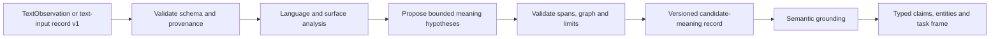

# Text perception and candidate meanings

**Status:** the current C++ baseline is implemented but uses hand-written English rules; it is not a trained language model and is not evidence of general language understanding. This document records its input/output contract and boundaries. The proposed learned replacement is specified in [the multilingual model proposal](LANGUAGE_PERCEPTION_MODEL_PROPOSAL.md). No trained model or training results are implemented yet; see [implementation notes](LANGUAGE_PERCEPTION_IMPLEMENTATION.md) for the legacy baseline.

The next stage after the C++20 text-input adapter should be a **language-perception component that returns a bounded set of source-linked meaning hypotheses**. It should not select one interpretation as truth, resolve mentions to real-world entities, turn language into trusted facts, or invoke a solver. Its contract should connect the adapter’s exact UTF-8 observation to the architecture’s downstream semantic-grounding layer.

This design follows the boundary in [the intelligence architecture](INTELLIGENCE_ARCHITECTURE.md), [the text-input adapter specification](TEXT_INPUT_ENGINE.md), and [the shared contracts](SPEC/CONTRACTS.md). It complements rather than replaces the existing factual-ingestion and formal-reasoning components.

## Place in the pipeline

The component consumes one text observation and emits interpretations of what the text could mean. Grounding later decides which entities, claims, task constraints, and permissions can be supported. A candidate such as “an event happened” is still only a hypothesis about the content of the text; it is not evidence that the event happened.

Version 1 should be **single-observation and context-explicit**. It must not silently consult prior conversation, memory, retrieval, or external knowledge. If the text depends on context—“yes,” “do that,” a pronoun without an antecedent—it should preserve the unresolved dependency. A future context-aware version can accept separately identified context observations and cite them in lineage.

## Representation choice

Use a **typed semantic-hypothesis graph**, with each candidate graph anchored to spans in the original text. The graph is an intermediate representation, not a full formal semantics. It can express predicate/event and proposition structure, surface mentions, participant-role hypotheses, modifiers, coreference candidates, scope, negation, modality, time expressions, and speech-act cues when the backend supports them. Nodes and relations should use a versioned, namespaced vocabulary; an unknown or unresolved role is valid and preferable to an invented universal label.

Do not make AMR or executable logical forms the sole contract. AMR contributes useful graph structures for semantic roles, coreference, negation, modality, and question forms, but a recent survey also documents areas where AMR can collapse distinctions, including ambiguity, tense/aspect, word order, and intentionality. A 2025 study specifically examines how ambiguity affects AMR graphs and annotation disagreement. These are reasons to preserve alternatives and unresolved features in XAI’s own record rather than forcing one canonical graph. See the [AMR survey](https://arxiv.org/html/2505.03229v1) and [ambiguity study](https://aclanthology.org/2025.comedi-1.14/).

Universal Dependencies can supply a useful language-oriented surface and syntax layer. Research on UDepLambda demonstrates semantic mapping from UD structures across languages, but syntax and semantic interpretation remain distinct operations. The design should therefore allow a backend to use UD-like analyses or other language-specific evidence without exposing its parser’s native object model as the XAI meaning contract. See [Universal Semantic Parsing](https://aclanthology.org/D17-1009/).

For example, “I saw the man with a telescope” should be allowed to produce two candidates: one where the telescope is an instrument of seeing, and one where “with a telescope” modifies the man. The result should preserve both possibilities and their source spans. It should not turn either candidate into a fact, and its rank order should not be presented as a probability.

## Proposed record contract

Use the shared `RecordEnvelope` with a new task schema, provisionally named **`xai.perception.text-meaning-candidates` version 1**. The input is either the C++ `TextObservation` or a decoded `xai.interaction.text-input` version 1 record. The record path must require an exact schema match; the component must not guess versions or reinterpret incompatible records.

The result payload should contain:

- An explicit reference to the input observation and its source. The output envelope should carry lineage to the adapter result (`derived_from`), observation (`observes`), source (`cites`), model (`produced_by`), and code build (`produced_by`) when those identifiers are available. Do not copy the full user text into the output merely to preserve provenance.
- A declared source-offset convention. Use zero-based, half-open **UTF-8 byte offsets into the adapter’s original, unnormalized content**. Validate that every span is in range and begins and ends on UTF-8 scalar boundaries. If a backend normalizes or otherwise transforms a working copy, it must map its spans back to the original bytes; output offsets into a private normalized copy are invalid. Tokenization is language-dependent and orthographic tokens do not always correspond one-to-one with syntactic words, as the [UD tokenization guidance](https://universaldependencies.org/u/overview/tokenization.html) explains.
- Language evidence that separates the adapter’s declared `locale` from any language detection. Treat the declared locale as a hint, not proof. If language is uncertain, represent ordered language hypotheses or mark it unresolved. Never silently replace the adapter’s metadata.
- An ordered list of candidate graphs. Candidate-local IDs identify nodes and edges only within that candidate; they are not persistent entity IDs. Each node may cite one or more source spans, or explicitly mark its content as implicit/unanchored. Each edge identifies a typed relation. Preserve quotation, negation, conditionality, modality, reported speech, intention, and question/command cues when supported so that embedded or hypothetical events are not mislabeled as asserted facts.
- An ambiguity and coverage description. State that the output is a bounded N-best set, record the requested and returned candidate counts, and indicate whether generation was truncated. Unless a procedure can establish exhaustiveness, label the set non-exhaustive. Include unresolved items such as lexical sense, attachment, scope, coreference, ellipsis, language identification, and discourse-act ambiguity where relevant.
- Reproducibility metadata for the algorithm, model identifier/revision, tokenizer or analysis artifacts, configuration hash, and seed when applicable. Record resource budget and actual use through the shared envelope.

Candidate **rank is ordinal only**. Version 1 should not publish a raw generator score as a confidence probability. If calibrated candidate probabilities are added later, they need an identified calibration method, model and data versions, and evaluation for the relevant language and domain. Confidence in semantic parsing has been observed to vary by model and dataset, and calibration metrics themselves have limitations; verbalized or raw model confidence alone is not adequate. See [Calibrated Interpretation](https://direct.mit.edu/tacl/article/doi/10.1162/tacl_a_00598/117737/Calibrated-Interpretation-Confidence-Estimation-in). Confidence-based rephrasing or asking can be useful downstream, but should be driven by validated confidence and task cost, not by treating an uncalibrated rank as certainty; see [Did You Mean...?](https://aclanthology.org/2023.emnlp-main.159/).

## Processing responsibilities

The component should perform these bounded steps:

1. Validate the input record schema, required identifiers, UTF-8 content, locale field, input-size declaration, and lineage. For a `TextObservation`, rely on the adapter’s accepted-object contract and still enforce this component’s own processing limits.
2. Establish language/surface evidence without mutating the original content. Route only to a declared supported backend. If the language or content kind is unsupported, return an explicit unsupported result rather than pretending a parse succeeded.
3. Generate up to a configured candidate limit. Keep alternatives that differ materially in meaning. If the limit is reached, mark the set truncated; do not imply that omitted interpretations do not exist.
4. Validate candidate-local references, graph structure, byte-span bounds, output size, and resource limits. Validate that every asserted surface-grounded element has an appropriate source span or an explicit implicit-content marker.
5. Emit a canonical versioned envelope with typed diagnostics and provenance. Diagnostics and ordinary logs must not echo raw text or sensitive candidate excerpts.

The model family and training objective are specified in [the multilingual model proposal](LANGUAGE_PERCEPTION_MODEL_PROPOSAL.md); its weights, corpus, supported languages, and serving runtime remain unselected and unimplemented. Keep a narrow C++20 facade in a new `xai::perception` namespace, with contract validation and serialization separated from backend inference. The public interface should accept an observation or compatible input record and return the shared typed envelope; it should not make model-vendor types, prompts, or transport formats part of the XAI schema. This fits the repository’s existing pattern of small libraries linked to `xai_contracts`.

## Status, uncertainty, and failure behavior

A returned candidate set is approximate by nature. Label it `status=approximate` and `exactness=approximate`, with a warning that candidates are model-generated hypotheses and may be incomplete. This matches the shared contract’s rule that an approximate record carries a result and at least one warning. Ambiguity is represented inside that result; it is not itself a processing failure.

If no defensible candidate can be emitted, use the existing abstention/unknown convention with no result and a typed diagnostic. Use `invalid_schema` for malformed or incompatible records, `unsupported_input` for unsupported language/content, `timeout` for timeouts, and `resource_limit` for explicit size or compute exhaustion. Never convert these failures into an empty-looking success record, a confident negative, or a fabricated default interpretation.

The input adapter allows up to 4 MiB of text, while a language backend may have a much smaller context or compute limit. The perception stage must define separate, explicit limits for input bytes/tokens, candidates, graph nodes/edges, wall time, memory, and serialized output. It must not silently truncate. If chunking is later supported, cross-chunk references and missing discourse context need explicit representation rather than being joined as if the chunks were interpreted together.

Keep the original text and result records under the caller’s access and retention policy. Treat input as untrusted data to interpret, not instructions for the component to execute. Do not provide tools, credentials, or action capability to the perception backend. Do not send text to an external inference service unless a deployment-level policy explicitly authorizes that route. These controls follow the architecture’s provenance, privacy, and permission boundaries. The W3C provenance model similarly treats generated entities, activities, their inputs, and responsible agents as distinct provenance relationships; XAI’s envelope can express the relevant subset without adopting PROV as its wire format ([PROV-DM](https://www.w3.org/TR/prov-dm/)).

## Evaluation gates before claiming capability

Evaluation should be added before any deployment claim and should follow the repository’s [evaluation-plan principles](TESTS/EVALUATION_PLAN.md): define a target language/domain, split data without source or near-duplicate leakage, report abstentions and failures, and make claims only for the tested population.

The core semantic tests should include inputs with multiple legitimate interpretations, including lexical ambiguity, attachment, quantifier scope, negation, modality, pronouns, quoted text, ellipsis, and multilingual or locale-uncertain examples in each supported language. Gold annotations must allow multiple acceptable readings rather than mark one arbitrary reading as uniquely correct. Measure candidate recall at the configured N, semantic-role and graph quality, source-span alignment, unresolved-ambiguity recall, and—especially—**false-resolution rate**, the rate at which the component hides a materially plausible alternative. Measure abstention and resource-limit behavior separately from semantic errors.

Contract tests should cover exact input-schema/version acceptance, canonical output round trips, lineage completeness, stable UTF-8 byte offsets for ASCII, multibyte characters, combining sequences and supplementary characters, and rejection of offsets inside a code point. Include truncated candidate sets, unknown relations, unsupported locale, empty/no-parse output, timeout, and oversized inputs. Test that logs and diagnostics contain no input content.

Do not claim calibrated probabilities in version 1. If calibration is added, report selective-risk/coverage curves and calibration metrics on held-out calibration and test splits, with language/domain breakdowns and shift stress cases. A good exact graph score alone does not establish faithful interpretation, and unit tests do not establish general language understanding.

## Decisions to close before engineering

The contract and stage boundary can be fixed now. The mathematical model is proposed in [the multilingual model proposal](LANGUAGE_PERCEPTION_MODEL_PROPOSAL.md); unresolved implementation choices are the initial supported languages/domains, legally permitted training data and annotation process, model checkpoint/size, on-device versus explicitly authorized remote inference, compute budget, and release thresholds. Choose these against a frozen evaluation set rather than hiding them in the schema. Keep a bounded N-best set, no calibrated probability field without separate calibration, no cross-message context in v1, and a replaceable backend adapter.

The initial C++ v1 baseline now implements the pipeline boundaries above. Its language and semantic coverage remain intentionally narrow; software contract tests do not establish general language understanding.
