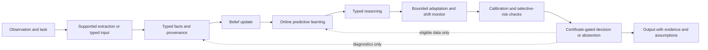

# XAI End-to-End Roadmap

## Purpose and status

This roadmap turns the candidate architecture into a staged, testable research program. The repository contains mathematical specifications, deterministic C++ component checks, a synthetic in-process orchestration harness, and a narrow exact-WMC reference solver for the selected Phase 0 task. It has no production end-to-end runtime, corpus training, complete benchmark evaluation, or deployment. Phase 9 is closed for project sequencing at the user's direction with a scope-limited 20/98 public-even diagnostic: XAI had zero exact completions and no final-odd solver scores were produced. The remaining frozen benchmark was deferred because it was estimated to take about 65 hours. Its original gate remains not passed, but it no longer blocks Phase 10; see [the Phase 9 closeout](RESULT/Phase-9-closeout.md).

The objective is a bounded research demonstrator that takes a task in a declared input format, preserves evidence and assumptions, computes supported beliefs and predictions, answers only questions its formal modules can handle, calibrates uncertainty on correctly partitioned data, and either chooses an admissible action or abstains. The initial demonstrator should prefer explicit, typed inputs and narrow task scopes over a claim of unrestricted language understanding.

## Claim boundary

The proposed core is non-neural: it does not depend on neural-network parameterization, transformers, or gradient-trained components. This is a scope choice, not a claim of independence from prior AI ideas. The architecture composes established methods; the composition is a hypothesis to evaluate, not an established advantage or new theorem.

Passing unit tests establishes only that tested code behaved as expected on stated fixtures. A result on one named dataset could support only a bounded claim for that task, implementation, population, and protocol. Neither is evidence of general intelligence, novelty, production readiness, or performance on arbitrary real-world data. Corpus byte size alone is not evidence of sufficiency.

## Intended end state

A successful research demonstrator will have:

- A versioned, reproducible end-to-end run from supported observation/task input to a structured answer or abstention.
- Typed facts, explicit unknowns, an immutable evidence trail, and declared source dependence.
- Inspectable probabilistic updates and sequential predictive learning over a task-specific, versioned model library.
- Bounded symbolic reasoning with explicit solver limits and correct `unknown`/`non_identified` outcomes.
- Bounded adaptation that is isolated from evidence updates, uses only declared development data, monitors change, and can roll back to a fixed baseline.
- Calibration and selective-risk reporting based on correctly separated data and stated assumptions.
- A fail-closed action/certificate policy with assumptions and evidence attached to each output.
- A task-specific evaluation against appropriate baselines, ablations, stress cases, and resource measurements, with null and negative findings retained.

This end state is a research prototype. Any operational or high-impact use would require a separately scoped risk, privacy, security, and deployment review.

## End-to-end information flow

This is an order of responsibilities, not a requirement to run every module for every task. A run must name skipped modules and explain why they are unnecessary. Fitting, development, calibration, and final test data remain separate; a held-out final result must not flow back into fitting or tuning.

## Roadmap principles

1. **Choose a task before choosing a corpus.** Specify the target population, input/output contract, outcome, permitted data, and practical success criterion before tuning models. Measure corpus quality, coverage, dependence, duplicates, labels, and leakage risk; do not use file size as a proxy.
2. **Make contracts executable.** Each module has a versioned input/output schema, explicit assumptions, resource limits, and failure statuses. Tests exercise both valid outputs and fail-closed behavior.
3. **Preserve provenance and unknowns.** Every factual belief can be traced to evidence and extractor/model versions. Missing facts remain unknown unless an explicit prior or closed-world rule applies. Copies and correlated sources are not independent corroboration by default.
4. **Keep learning, adaptation, and evaluation distinct.** Predictive updating follows a declared data-use policy. Configuration search uses only development objectives. Calibration data are separate from fitting and final testing. Final test data are read-only until the protocol is frozen.
5. **Bound computation and claims.** Exact methods are used where tractable; approximation methods, bounds, and timeouts are labeled. Unsupported input, inconsistency, non-identification, shift alarms, and resource exhaustion never become confident answers.
6. **Use baselines and report the whole result.** Compare against simple, task-appropriate alternatives under comparable data and tuning budgets. Preserve failures, confidence intervals, software/data versions, seeds, and negative results.

## Phases and gates

Phases define exit criteria, not calendar promises. Some component work can proceed in parallel after the shared contracts are stable, but integration gates remain sequential. The detailed plan and checkable work items live in [Phase.md](Phase.md) and [TODO.md](TODO.md).

| Phase | Outcome | Exit gate |
|---|---|---|
| 0. Scope and research protocol | One bounded task, intended population, input/output, claim boundary, and evaluation protocol are defined. | The task, data-use policy, success measures, and baseline plan are reviewable before fitting or final-test access. |
| 1. Contracts and reproducible foundation | Shared schemas, identifiers, statuses, deterministic build/test workflow, and versioning rules exist. | Contract tests cover serialization, schema rejection, provenance identifiers, partition labels, and explicit failure states. |
| 2. Factual ingestion | Typed facts, evidence records, open-world behavior, dependence metadata, and finite belief updates work together. | Invariants and edge cases pass; each query result exposes lineage and normalization/approximation status. |
| 3. Predictive learning | A declared model library updates in log space and emits replayable predictions and scores. | Sequential updates, zero-probability handling, prior/library versioning, and data partitions are tested. |
| 4. Bounded reasoning | Finite constraints, SAT/WMC, and supported causal query paths return truthful statuses. | Small exact cases agree with independent fixtures; timeout, inconsistent, zero-denominator, and non-identified cases fail explicitly. |
| 5. Bounded adaptation | Development-only search, parameter bounds, change alarms, baseline freeze, and rollback are implemented. | Bounds and data boundaries are enforced; alarms and regressions demonstrably freeze or roll back updates. |
| 6. Calibration and diagnostics | Proper scores, calibration summaries, conformal outputs where assumptions hold, and shift diagnostics are available. | A frozen calibration split is used; assumptions, sample counts, coverage limitations, and unsupported shift cases are reported. |
| 7. Decision and output gate | Loss/cost decisions, certificate validation, abstention, and structured outputs are implemented. | Invalid/missing required certificates exclude actions; malformed or unsupported state cannot produce an unqualified answer. |
| 8. Input mapping and orchestration | Supported raw inputs map to typed records and a versioned orchestrator runs the complete supported path. | End-to-end fixtures replay deterministically, preserve traceability, and expose skipped modules and all failures. |
| 9. Task-specific evaluation | A frozen experiment compares the system, baselines, and ablations on valid held-out data and stress cases. | Full benchmark gate remains not passed; the user-approved scope-limited closeout documents the 20/98 diagnostic and permits Phase 10 to proceed without claiming complete evaluation. |
| 10. Reproduction and research release | Another run can reproduce the artifacts and the public claims match the evidence. | A clean build/run reproduces reported results within stated tolerances; limitations and unresolved gaps are prominent. |

## Evaluation design

The evaluation is not a final add-on: its protocol starts in Phase 0 and the first runnable checks are built with the contracts. Before an empirical run, freeze and document the task, target population, data version, preprocessing, deduplication/entity policy, label quality, source dependence, allowed input/output, and outcome timing.

Partition data into training, development, calibration where needed, untouched final test, and temporal or domain-shift evaluation. Prevent entity, source, and near-duplicate leakage where it would invalidate the question. Fix model libraries, priors, thresholds, adaptation bounds, and selection procedures before final-test use.

Report task-specific utility and uncertainty; proper predictive scores; calibration summaries; conformal coverage and set size only under applicable assumptions; selective risk versus coverage; provenance and extraction fidelity; contradiction and entity-resolution error; and runtime, peak memory, stored-state size, I/O, and approximation/error status. Include confidence intervals, all failures, seeds, exact software and data versions, and protocol deviations.

At minimum, compare the full system with simple task-appropriate baselines and ablate provenance tracking, dependence-aware evidence handling, adaptation, and abstention. Stress cases should include copied/correlated reports, contradictions, identity errors, missing evidence, temporal drift, out-of-domain inputs, solver timeout, and corrupted/incomplete records. State whether the system abstained or surfaced a failure.

## Major design decisions to resolve

Resolve these only when their phase requires them, record the choice and alternatives, and avoid implying an unvalidated choice is a guarantee:

- **Task and representation:** which initial task is narrow enough to evaluate, which inputs are supplied structurally, and what unresolved entity identity looks like.
- **Storage and persistence:** in-memory versus durable evidence/state store, transaction boundaries, schema evolution, retention, and replay policy.
- **Likelihoods and dependence:** how source likelihoods are supplied or estimated, how duplicate/correlated sources are linked, and which updates are exact or approximate.
- **Inference scale:** finite grounding policy, exact solver choice, query limits, approximation policy, and resource budgets.
- **Predictive model library:** task-appropriate models, priors, sufficient statistics, missing-data behavior, and model/library versioning.
- **Adaptation:** mutable parameters, development objective, candidate search procedure, thresholds, baseline, hold-off, and rollback rules.
- **Calibration and decisions:** sample requirements, target risk, loss/cost model, abstention cost, certificate policy, and verifier trust boundary.
- **Input extraction:** whether initial users provide typed data, use a constrained deterministic parser, or use another explicitly permitted preprocessing system. This roadmap does not assume general-purpose language understanding.

## Risks and required responses

- **The task is underspecified or too broad:** narrow the task or remain at component-specification stage; do not compensate by adding arbitrary data.
- **Extraction or entity resolution is unreliable:** expose uncertainty, measure errors, and constrain the supported input format rather than silently coercing.
- **Evidence dependence is unknown:** preserve dependency links and avoid multiplying reports as independent likelihoods.
- **The solver or exact state space exceeds budget:** return timeout/unsupported/approximate status with limits; do not hide resource exhaustion.
- **Adaptation worsens behavior or invalidates the detector:** freeze exploration, select the declared baseline, and investigate on development data only.
- **Calibration assumptions fail under shift:** withdraw the corresponding coverage claim and report measured diagnostics without extrapolation.
- **Evaluation leakage or test-driven tuning occurs:** invalidate the affected final result, revise the protocol, and obtain a new untouched test set.
- **Results are null or worse than a baseline:** report them; revise or stop the hypothesis rather than overstate component-level math.

## Success criteria and stop conditions

The project advances only when a phase's exit gate is met and recorded. A demonstrator succeeds as a research artifact if an independent reader can reconstruct the supported computation and assumptions, reproduce the reported task-specific measurements, and see explicit limitations and failures. It need not beat a baseline for the documentation and experiment to be useful; a negative result is a valid outcome.

Stop, narrow, or redesign if no task/data protocol supports meaningful evaluation, if an essential module cannot meet its contract within declared resource limits, if provenance or data separation cannot be maintained, or if empirical results do not support the proposed composition. Do not use more data, more parameters, or broader claims as substitutes for evidence.

## Related project documents

- [Project overview](Project.md)
- [End-to-end architecture specification](SPEC/END_TO_END_FLOW.md)
- [Formal research paper](SPEC/RESEARCH_PAPER.md)
- [Component specifications](SPEC/README.md)
- [Evaluation plan](TESTS/EVALUATION_PLAN.md)
- [Mathematical verification record](TESTS/MATHEMATICAL_VERIFICATION.md)
- [Detailed phase execution plan](Phase.md)
- [Phased implementation checklist](TODO.md)
