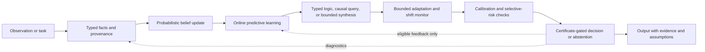

# End-to-End Architecture Specification

## 1. State

At logical version \(t\), the system state is

\[
S_t=(G_t,\mathcal E_t,\Pi_t,\mathcal M_t,\mathcal C_t,\mathcal A_t),
\]

where \(G_t\) is the probabilistic fact state, \(\mathcal E_t\) the evidence ledger, \(\Pi_t\) the predictive learning state, \(\mathcal M_t\) the typed reasoning model, \(\mathcal C_t\) calibration and shift diagnostics, and \(\mathcal A_t\) candidate actions, costs, and certificates.

Persisted state is versioned and associated with schema, data, model, and code identifiers. Each result records whether it is exact or approximate and the relevant approximation status.

## 2. Data-flow contract

The diagram is a proposed order of responsibilities, not a claim that every task needs every computation. An implementation must mark skipped modules and explain why their outputs are not required.

## 3. Processing semantics

1. Preserve the original observation and source metadata; map extracted claims to typed entities and facts while representing unresolved identity explicitly.
2. Append evidence with likelihood or constraint semantics, dependence metadata, time, and extraction version.
3. Update the probabilistic fact state. Return query marginals, evidence lineage, normalization status, and an approximation label or bound where available.
4. Update predictive models only under the declared data-use policy. Return predictions, model weights, sufficient statistics, and cumulative score information.
5. Encode a bounded task in a typed reasoning representation. Return only results supported by the selected solver and assumptions, such as `sat`, `unsat`, `probability`, `identified`, `non_identified`, `synthesized`, or `unknown`.
6. Permit adaptation only against a named development objective and bounded parameter set. A change alarm or invariant failure freezes exploratory updates and selects the designated baseline.
7. Evaluate calibration and selective risk on correctly partitioned data. Do not use final test data for tuning or calibration.
8. Verify required certificates, compare expected loss plus cost, and abstain when no certified action is admissible or abstention has lower expected risk.
9. Emit the answer or action with probabilities, assumptions, provenance identifiers, version hashes, certificate status, and limitations.

## 4. Cross-pillar invariants

- **Provenance:** every factual belief can be traced to evidence identifiers and extraction/model versions.
- **Dependence:** repeated or copied sources are not multiplied as independent evidence unless the dependence assumption is justified.
- **Open-world default:** absence of a fact means unknown unless a declared prior or closed-world rule says otherwise.
- **No silent coercion:** failed identification, inconsistency, solver timeout, unsupported input, alarms, and approximation are explicit statuses, not confident answers.
- **Data separation:** training, development, calibration, and final evaluation records are labeled separately; held-out results do not flow back into fitting.
- **Bounded adaptation:** every mutable parameter has declared limits, an objective, a version, and a rollback baseline.
- **Fail-closed action gate:** when an action requires a certificate, an absent or invalid certificate bars that action.

## 5. Interface envelope

Each component consumes a versioned input record and returns a versioned result containing: status; value or structured result; assumptions; source/evidence identifiers; model/code/schema identifiers; exact/approximate designation; and errors or unresolved conditions. Module-specific mathematical contracts are defined in `components/`.

## 6. Unresolved design decisions

The architecture does not yet specify a raw-language extractor, entity-resolution algorithm, storage engine, finite grounding policy, likelihood-estimation method, solver selection, persistent posterior representation, or resource budget. These are implementation and research decisions that must be made without changing the guarantees claimed by the mathematical modules.