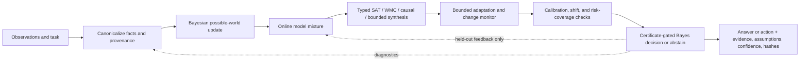

# A Candidate Non-Neural Architecture Built from Explicit Belief, Logic, and Decision Modules

**Research proposal and mathematical specification**  
**Document status:** Mathematical architecture specification and research hypothesis; no performance, novelty, or general-intelligence claim is established.

## Abstract

This paper specifies a candidate modular system with six requested pillars: factual ingestion, learning, evolution/adaptation, reasoning, calibration, and output. The design uses explicit probabilistic state, symbolic constraints, sequential model averaging, bounded parameter search, change detection, uncertainty audits, and certificate-gated decisions. Each module has established mathematical foundations. The proposed contribution at this stage is only their interface and composition; no new theorem, performance advantage, or general-intelligence claim is established.

The proposed contribution at this stage is the explicit interface and composition of established methods; no new theorem, performance advantage, or general-intelligence claim is established. Existing work in cognitive architectures, logic-based agents, probabilistic reasoning, planning, and program synthesis creates material prior-art overlap. Therefore “never claimed before” cannot be asserted from this review.

## 1. Scope and claim discipline

The requested requirements “not claimed,” “entirely independent of current AI architecture,” and “figures out intelligence” are not presently operational mathematical statements. This proposal replaces them with testable boundaries: no neural-network parameterization, no transformer dependency, and no gradient-trained component in the proposed core. The system may still use long-established symbolic AI, probabilistic inference, control, and decision theory. It cannot be called independent of all prior AI ideas.

The architecture is intended to make its beliefs, assumptions, inferences, uncertainty, and action constraints explicit. It does not yet specify how raw unrestricted language is translated into the formal representations below. That is an essential research problem, not something these equations solve by themselves.

“Mathematically verified” needs a boundary. Some modules have established theorems under stated assumptions; those results do not imply that the full composition is correct, that source evidence is true, or that assumptions hold in deployment. Implementation correctness and empirical performance require separate evaluation.

## 2. State and information flow

Use a versioned state object

\[
S_t=(G_t,\mathcal{E}_t,\Pi_t,\mathcal{M}_t,\mathcal{C}_t,\mathcal{A}_t),
\]

where \(G_t\) is the probabilistic fact graph, \(\mathcal{E}_t\) is its immutable evidence ledger, \(\Pi_t\) is the learned predictive state, \(\mathcal{M}_t\) is a typed reasoning model, \(\mathcal{C}_t\) stores calibration and shift diagnostics, and \(\mathcal{A}_t\) stores candidate actions, costs, and certificates. Every persisted state has a schema version, data/model/code hashes, and explicit approximation flags.

A feedback edge must not silently reuse a held-out evaluation set for training or calibration. Each module records whether it used a record for training, tuning, calibration, or final testing.

## 3. Pillars and mathematical models

### 3.1 Factual ingestion: provenance-aware possible worlds

Normalize a fact to a typed ground atom or graph triple, such as \(X_i=\texttt{(subject, relation, object)}\). Let \(x=(x_1,\ldots,x_n)\in\{0,1\}^n\) represent a possible world. For an independent-fact baseline,

\[
P_0(x)=\prod_i p_i^{x_i}(1-p_i)^{1-x_i}.
\]

For correlated facts, use a factor graph or Bayesian network:

\[
P_0(x)=Z_0^{-1}\prod_k \psi_k(x_{S_k}),\qquad Z_0=\sum_x\prod_k\psi_k(x_{S_k}).
\]

An observation \(e_t=(y_t,\ell_t,\tau_t,\nu_t,d_t)\) records its value, likelihood, timestamp, extractor/version, and provenance/dependency metadata. Its update is

\[
P_t(x)=\frac{P_{t-1}(x)L_t(y_t\mid x)}{Z_t},\qquad
Z_t=\sum_x P_{t-1}(x)L_t(y_t\mid x).
\]

A query \(Q\) returns \(P_t(Q)=\sum_{x\models Q}P_t(x)\), along with its evidence IDs and model version. Exact marginalization is possible for finite small cases; large cases may require approximations whose method and error are separately reported.

The factorized possible-world interpretation and tuple-independence model are established. Tuple independence is an assumption, not a fact about the world. In particular, duplicated reports must not be treated as independent evidence. Open-world semantics are also required: an absent triple must remain “unknown” unless a documented prior, probability interval, or closed-world rule says otherwise. Probabilistic database literature explicitly distinguishes these policies and analyzes inference complexity. [Open-World Probabilistic Databases: Semantics, Algorithms, and Complexity](https://starai.cs.ucla.edu/papers/CeylanAIJ21.pdf) [Bayesian Inference with Complex Knowledge Graph Evidence](https://ojs.aaai.org/index.php/AAAI/article/view/30040)

### 3.2 Learning: online Bayesian model averaging

Let \(\mathcal{H}\) be a declared, finite or countable library of predictive models with prior mass \(\pi(h)>0\). For a sequence \(z_1,\ldots,z_n\), define the sequential mixture

\[
q(z_t\mid z_{<t})=\sum_{h\in\mathcal{H}}w_t(h)p_h(z_t\mid z_{<t}),\qquad
w_t(h)=\frac{\pi(h)p_h(z_{<t})}{\sum_j\pi(j)p_j(z_{<t})}.
\]

After observing \(z_t\), update \(w_{t+1}(h)\propto w_t(h)p_h(z_t\mid z_{<t})\). With logarithmic loss, the cumulative predictive loss satisfies the pointwise mixture bound

\[
\sum_{t=1}^n-\log q(z_t\mid z_{<t})\leq
\sum_{t=1}^n-\log p_h(z_t\mid z_{<t})+\log\frac{1}{\pi(h)}
\]

for every library member \(h\). This follows because the mixture assigns the observed sequence at least \(\pi(h)\) times the probability assigned by \(h\). It is a relative guarantee against the declared library; it does not guarantee that a good model is in that library. [Some PAC-Bayesian Theorems](https://link.springer.com/article/10.1023/A:1007618624809) [Horizon-Independent Optimal Prediction with Log-Loss in Exponential Families](https://proceedings.mlr.press/v30/Bartlett13.html)

A practical initial library could include categorical and finite-state models, conjugate Gaussian models, regularized linear/logistic models, and small decision trees. Parameters and sufficient statistics can be streamed; data size alone does not imply the chosen models capture the task. All predictive calculations should be in log space. A prior is chosen before the evaluated sample. More complex generalization claims can use a named PAC-Bayes theorem, but its iid/bounded-loss and prior-selection assumptions must be recorded rather than treating it as a universal guarantee. [Some PAC-Bayesian Theorems](https://link.springer.com/article/10.1023/A:1007618624809)

### 3.3 Evolution and adaptation: bounded search plus change detection

Keep adaptation separate from factual inference. Let \(\theta\in\Omega=\{\theta:\|\theta\|_2\leq\Theta\}\) be a bounded set of configuration parameters, and let \(J(\theta)\) be an objective computed on a development set disjoint from the final test set. A CMA-ES-style generation samples

\[
y_k=m+\sigma C^{1/2}z_k,\quad z_k\sim\mathcal{N}(0,I),
\]

ranks candidate outcomes by the declared objective, and recombines the best candidates:

\[
m^+=\sum_{i=1}^{\mu}w_i y_{i:\lambda},\qquad \sum_iw_i=1,\quad w_i\geq0.
\]

CMA-ES has established covariance and step-size adaptation equations; the basic test here checks only a weighted recombination step. [The CMA Evolution Strategy: A Tutorial](https://arxiv.org/html/1604.00772) Project parameter updates back into their permitted set, e.g. \(\theta^+=\operatorname{Proj}_{\Omega}(\theta+\eta g)\). Projection proves the parameter remains bounded; it does not prove the full system is stable or safe.

For a monitored scalar residual \(r_t\), a log-likelihood-ratio CUSUM is

\[
W_{t+1}=\max\left(0,W_t+\log\frac{f_1(r_t)}{f_0(r_t)}\right),\qquad
\text{alarm if }W_t>b.
\]

On alarm, freeze exploratory adaptation, reset or shrink the search state, and use a fixed baseline until a stated hold-off rule is met. False-alarm and delay guarantees depend on the residual distributions and assumptions; adapting the controller can itself change the residual distribution. [CUSUM Control Charts](https://www.itl.nist.gov/div898/handbook/pmc/section3/pmc323.htm) [Quickest Change Detection](https://arxiv.org/html/1210.5552)

### 3.4 Reasoning: finite symbolic constraints and weighted model counting

Translate a bounded task into a finite typed representation \((H,w,E,Q)\): hard propositional constraints \(H\), nonnegative literal weights \(w\), evidence \(E\), and query \(Q\). Define weighted model count

\[
\operatorname{WMC}(F,w)=\sum_{x\models F}\prod_{\ell\text{ true in }x}w(\ell),
\]

and, when the denominator is nonzero,

\[
P(Q\mid E,H)=\frac{\operatorname{WMC}(H\land E\land Q,w)}
{\operatorname{WMC}(H\land E,w)}.
\]

DPLL/CDCL can return a satisfying assignment or an unsatisfiability result for finite propositional CNF; WMC gives exact probabilities for finite representations when computed exactly. Worst-case inference can be exponential, and first-order grounding must be finite or use a separately justified semantics. [Abstract DPLL and Abstract DPLL Modulo Theories](https://web.stanford.edu/class/cs357/NOT04.pdf) [Probabilistic Theorem Proving](https://cacm.acm.org/research/probabilistic-theorem-proving/)

Causal questions use a separately marked structural causal model. An intervention query \(P(Y\mid\operatorname{do}(X=x))\) is answered only if the supplied causal graph and assumptions identify it. If not identified, the module returns `non_identified`, not a number inferred from correlation. [The Do-Calculus Revisited](https://ftp.cs.ucla.edu/pub/stat_ser/r402.pdf) Optional bounded program synthesis searches a finite grammar for a candidate that satisfies a stated specification, then returns a verifier result or `unknown`; it does not claim unrestricted synthesis or complete natural-language reasoning. [Introduction to Program Synthesis](https://people.csail.mit.edu/asolar/SynthesisCourse/Lecture1.htm)

### 3.5 Calibration: proper scores, conformal coverage, and diagnostics

For probabilistic output \(p\) and binary outcome \(Y\), evaluate a strictly proper score such as Brier loss and log loss:

\[
\operatorname{BS}(p,Y)=(p-Y)^2,\qquad
\operatorname{LS}(p,Y)=-Y\log p-(1-Y)\log(1-p).
\]

A proper score rewards reporting the true distribution in expectation under the evaluation distribution. Calibration is not the same as sharpness, and scores do not protect against distribution change. [Strictly Proper Scoring Rules, Prediction, and Estimation](https://sites.stat.washington.edu/raftery/Research/PDF/Gneiting2007jasa.pdf)

For a split-conformal predictor with exchangeable calibration and future observations, sort nonconformity scores \(R_1,\ldots,R_n\), and use the \(k=\lceil(n+1)(1-\alpha)\rceil\)-th order statistic, returning an unbounded set if \(k>n\). This yields finite-sample *marginal* coverage at least \(1-\alpha\) under exchangeability. It does not promise conditional coverage for every subgroup or feature value. Weighted conformal methods can address a specified covariate-shift model when the conditional outcome mechanism stays fixed and the density ratio conditions hold; arbitrary shift is not covered. [Distribution-Free Predictive Inference for Regression](https://www.stat.cmu.edu/~ryantibs/papers/conformal.pdf) [Conformal Prediction Under Covariate Shift](https://www.stat.cmu.edu/~ryantibs/papers/weightedcp.pdf)

The reporting interface should keep these distinct: proper test scores; reliability bins with their definitions; conformal coverage and set width; risk-versus-coverage for abstention; simulation-based calibration for inference code; posterior predictive checks for model adequacy; and shift diagnostics. Simulation-based calibration can detect some implementation errors under a chosen generative model, but it cannot prove the model describes reality. [Validating Bayesian Inference Algorithms with Simulation-Based Calibration](https://sites.stat.columbia.edu/gelman/research/unpublished/sbc.pdf)

### 3.6 Output: Bayes decision with abstention and a certificate gate

Given a belief \(q(\theta\mid h)\), candidate action \(a\), loss \(L(a,\theta)\), resource cost \(c(a)\), abstention action \(\bot\) with cost \(\rho\), and a certificate verifier \(V\), define

\[
R(a\mid h)=\mathbb{E}_{\theta\sim q}[L(a,\theta)]+\lambda c(a).
\]

Select the least-risk admissible action among those with a valid required certificate, or abstain:

\[
a^*=\arg\min_{a\in\{\bot\}\cup\mathcal{A}_{\mathrm{cert}}}R(a\mid h),
\qquad R(\bot\mid h)=\rho.
\]

A certificate proves only the encoded property under the assumptions and soundness of the verifier; it does not prove that the property expresses the user’s full intent. Bayesian decision theory, reject options, and proof-carrying code are established separately. Their combination here is an engineering proposal, not a new theorem. [Optimal Strategies for Reject Option Classifiers](https://jmlr.org/papers/v24/21-0048.html) [On the Foundations of Noise-Free Selective Classification](https://www.jmlr.org/papers/volume11/el-yaniv10a/el-yaniv10a.pdf) [Proof-Carrying Code](https://homes.cs.washington.edu/~mernst/teaching/6.893/readings/necula-popl97.pdf)

## 4. Component interface and end-to-end flow

The runtime flow is:

1. Receive a fact, observation, or task; preserve the original bytes and source metadata.
2. Canonicalize entities and map extracted claims to typed facts. Record uncertainty in entity resolution rather than silently choosing an identity.
3. Append an immutable evidence item. Declare whether it is independent of earlier evidence and provide a likelihood or hard constraint.
4. Update the possible-world distribution, returning query marginals, normalization status, evidence lineage, and any approximation/error status.
5. Stream examples through the declared model library, returning predictive probabilities, updated weights, sufficient statistics, and cumulative log score.
6. Translate a task into a typed reasoning representation. Return `sat`, `unsat`, `probability`, `identified`, `non_identified`, `synthesized`, or `unknown` only where the relevant module supports it.
7. Permit bounded adaptation only on an explicitly declared development objective. A change alarm or invariant failure freezes exploration and selects the baseline.
8. Run separate calibration, shift, and risk-coverage reporting on a correctly partitioned dataset.
9. Verify required action certificates, minimize posterior expected loss plus cost, or abstain.
10. Emit answer/action together with probability, assumptions, provenance IDs, code/model hashes, certificate status, and limitations.

No absent fact, failed causal identification, invalid certificate, detector alarm, or inference approximation may be silently converted to a confident assertion. Approximate inference must carry a labeled approximation method and an error estimate or state explicitly that no certified error estimate is available.

## 5. Prior art and novelty assessment

There is substantial prior art on pieces of this design and on systems combining many of the same functions. GOLOG maintains explicit dynamic-world representations from action axioms and reasons about courses of action before behavior. [GOLOG: A Logic Programming Language for Dynamic Domains](https://doi.org/10.1016/S0743-1066(96)00121-5) Soar documents a cognitive architecture with working and long-term memories, decision making, learning, and reasoning. [Introduction to Soar](https://arxiv.org/abs/2205.03854) Probabilistic logic programming combines logic with probability; DeepProbLog combines neural predicates with probabilistic logic; active inference formalizes perception, memory, planning, and action through generative models. [Bayesian Inference with Complex Knowledge Graph Evidence](https://ojs.aaai.org/index.php/AAAI/article/view/30040) [DeepProbLog: Neural Probabilistic Logic Programming](https://proceedings.neurips.cc/paper/2018/hash/dc5d637ed5e62c36ecb73b654b05ba2a-Abstract.html) [Active Inference: The Free Energy Principle in Mind, Brain, and Behavior](https://direct.mit.edu/books/oa-monograph/5299/Active-InferenceThe-Free-Energy-Principle-in-Mind) Program synthesis and model-based planning are also established areas. [Introduction to Program Synthesis](https://people.csail.mit.edu/asolar/SynthesisCourse/Lecture1.htm)

The sources inspected establish meaningful overlap, not that one reference contains this exact proposed interface. This is not an exhaustive scholarly or patent search, and it is not legal advice. The defensible statement is: **“A targeted initial review found substantial overlap with established cognitive architectures, logic-based agents, probabilistic reasoning, planning, and program synthesis; the exact proposed module interfaces remain a hypothesis requiring a scoped prior-art search.”** Do not use “first,” “never claimed,” “unprecedented,” or “entirely independent” on this evidence.

A novelty claim would need a versioned, precise claim set; a documented search across publications, theses, preprints, and patent families; a claim chart against the closest references; and, for technical merit, an identifiable algorithmic or formal delta with controlled experiments. This specification is not evidence of novelty.

## 6. Implementation boundary

C++ is a reasonable implementation language for explicit typed state, deterministic inference kernels, provenance storage, and performance measurement. Assembly should be introduced only after a reference implementation is correct and profiling identifies a specific bottleneck; low-level code changes throughput, not the mathematical assumptions or capability claims. Data structures, persistence rules, solver choice, likelihood estimation, and resource budgets remain open design decisions.
