# Training plan for the multi-component XAI architecture

XAI should **not** be trained as one end-to-end model. Its components hold different kinds of state and obey different data-use rules: one predicts labeled outcomes, one updates beliefs from evidence, one searches bounded solver settings, and the others reason, measure uncertainty, or gate outputs. Combining those into one optimizer would blur their guarantees and make it impossible to tell which component learned what.

This is a proposed operating plan based on the current specifications. It does not claim a training run has happened. The current code is a set of component harnesses; the Phase 8 orchestrator starts fresh in-process state and does not persist or reuse a trained system.

## What “training” means in this architecture

- **Predictive learning is the trainable component.** It observes eligible input/outcome pairs, predicts before seeing each outcome, then updates its sufficient statistics and mixture weights. Its model library, priors, feature schema, and update policy are fixed and versioned for a run.
- **Factual ingestion is a belief update, not model training.** It combines supplied priors with explicit evidence likelihoods or hard constraints. The current implementation does not estimate source reliability, priors, extraction quality, or entity identity from a corpus; those values must be justified and supplied. Each new evidence record updates the current finite belief state without rewriting the evidence history.
- **Reasoning is not trained.** The current path evaluates typed finite constraints and exact weights. Rules and task encodings are supplied as part of the formal task; unsupported mappings remain unsupported rather than being inferred from examples.
- **Evolution/adaptation is development-only configuration search.** It changes only declared bounded settings against a named development objective. This is not gradient training, does not rewrite facts or rules, and must retain a fixed rollback baseline.
- **Calibration is currently evaluation-only.** It reports scores, reliability, risk/coverage, and assumption-gated conformal diagnostics; it does not recalibrate or refit predictions.
- **Decision and output are not trained.** The current policy uses caller-supplied probabilities, losses, resource costs, and a certificate verifier. Those are configuration inputs, not learned parameters; the current verifier is synthetic and is not a production proof checker.
- **Input extraction is not implemented in the supported runtime.** The supported orchestration route takes typed structured WMC input. There is no general-language extractor or entity-resolution trainer in this repository. An offline KILT T-REx slot-filling/count-ranking experiment is being prepared separately; its KILT rows lack sentence-level span labels and stable entity/property IDs, so it does not change this runtime boundary or establish general-language/entity-resolution capability. Adding a production extractor would be a separate design decision and would change the current non-neural core boundary if it introduced a neural dependency.

## The concrete first learning target

The implemented predictive learner targets whether an eligible, parser-valid WMC formula receives an exact solver result within the declared limits. The positive label is `completed_exact`; the negative label is an explicit solver status with no exact count. Malformed or ineligible formulas, external process kills, and other runs without a trustworthy explicit solver result are `non_result` and must not be relabeled as solver noncompletion.

The current fixed library, `library:wmc-completion-v1`, contains three equally weighted Beta-Bernoulli experts: a global outcome model, a logarithmic structural-bucket model keyed by variable/clause/literal-occurrence counts, and a previous-outcome model. Each begins with a Beta(1,1) prior. For each eligible example, first emit

\[
q_t(y)=\sum_h w_{h,t}p_{h,t}(y),
\]

then, only after the valid outcome is observed, update

\[
w_{h,t+1}=\frac{w_{h,t}p_{h,t}(y_t)}{q_t(y_t)}
\]

and the experts’ sufficient counts. The implementation uses log-space mixture updates and records model weights, scores, accepted observations, partition decisions, and version hashes. This gives a relative log-loss guarantee against a member of this fixed library, not a promise of absolute accuracy or generalization.

For a future corpus-based run, examples must be processed in a declared order (normally time order or a frozen deterministic order). Generate each prediction before exposing that example’s label to the learner; score the prediction, then call `observe()` only for an authorized training or streaming example with a trustworthy outcome. Keep features available at prediction time separate from solver outcomes and post-run measurements, so no target leakage enters the structural predictor.

## Training lifecycle and data boundaries

1. **Freeze the task before fitting.** Specify the target population, supported input, label and outcome timing, eligible records, resource limits, baselines, metrics, stopping rule, and claim boundary. Inspect duplicates, source/formula dependence, missing labels, and leakage risks first. A new target or corpus requires its own protocol.
2. **Create independent data roles.** Assign records to `training`, `development`, `calibration` (if a calibrated predictor is required), `final_test`, or `streaming`. Group by formula/source and near-duplicate families before splitting when those relationships could leak. The exact split design must follow the size and collection process; do not choose a convenient percentage without inspecting the data. Freeze IDs and hashes before fitting.
3. **Fit or initialize only what the component supports.** Fix the predictor library and priors before the training sequence. Initialize factual priors/likelihoods as explicit, versioned inputs. If future work estimates them from labeled evidence audits, that must be a separate estimator with its own target, training data, uncertainty, dependence policy, and validation; the present ingestion code does not perform that estimation.
4. **Run sequential predictive updates on training data.** Predict, score, then update. Record every accepted or rejected training-use decision and the outcome provenance. Do not update on development, calibration, or final-test examples. The existing learner also allows authorized `streaming` updates, but once streaming starts it will not return to training mode.
5. **Tune bounded configuration on development data only.** Keep the baseline fixed. In the current adaptation harness, the only mutable value is the WMC solver `node_limit` from `{1,2,4,8,16,32,64,128}`; the objective is exact development completions, with ties favoring the smaller cap. Oracle or invariant failures, regressions, streaming failures, and a shift alarm freeze search and restore the baseline. Do not use final-test outcomes to choose the grid, objective, thresholds, or candidate.
6. **Evaluate calibration separately after model fitting and development selection.** Use a disjoint calibration set and a frozen prediction model. The current calibration component only computes diagnostics; it does not change predictions. If a later project adds a calibration transform, fit that transform only on calibration data, version it separately, and reserve final-test observations for evaluation alone. Only state conformal coverage claims when exchangeability or the explicitly declared alternative assumptions are defensible.
7. **Freeze all choices before final evaluation.** Lock model/library and prior hashes, feature and label schemas, adaptation result, calibration protocol, solver and decision settings, code/data/configuration hashes, and evaluation scripts. Run final-test data read-only, report all failures and abstentions, and do not feed its outcomes back into fitting, adaptation, or calibration. Any post-test change needs a new untouched test set for a confirmatory claim.
8. **Treat online learning as a separate release policy.** Streaming updates require an explicit authorization, label source, temporal ordering, audit, version transition, rollback/retraining rule, and monitoring procedure. They are not enabled by the current orchestrator’s ordinary route, which initializes fresh state for each invocation. A persistent production learner is not implemented.

```mermaid
flowchart LR
    P[Freeze task, label, protocol] --> D[Audit and partition data]
    D --> I[Initialize priors, fixed library, versions]
    I --> T[Training: predict → score → update]
    T --> V[Development: bounded config search]
    V --> C[Calibration: diagnostics, or separately versioned fit]
    C --> F[Freeze models and policy]
    F --> E[Final test: read-only evaluation]
    E -. new authorized labels only .-> S[Separate streaming policy]
```

## Component-by-component fitting and freeze rules

| Component | What changes with data | Allowed data | What must remain fixed or separate |
|---|---|---|---|
| Factual ingestion | Current belief state changes when evidence factors are appended and exact inference is run. | Evidence admitted under the task’s source, dependence, and partition policy. | Evidence is append-only; priors/likelihoods are externally supplied today. Never treat repeated or correlated sources as independent by default. |
| Predictive learning | Beta sufficient counts, predictive scores, and mixture weights update after authorized labels. | `training` and authorized `streaming` only. | Fixed feature schema, three-expert library, initial prior, label definition, order, hashes, and non-result exclusion. |
| Bounded reasoning | No statistical fitting; the solver computes an exact result for a declared typed task. | Task input and declared constraints/weights, subject to resource limits. | Do not learn rules from final answers. Unsupported grounding, causal queries without an implementation, or resource exhaustion must remain explicit. |
| Adaptation | One named bounded solver setting is selected against development outcomes. | `development` only; streaming records are monitor inputs, not a search set. | Baseline, finite candidate set, objective, detector assumptions, rollback and hold-off rules. No final-test tuning. |
| Calibration | Scores and diagnostics are computed; no model parameter changes in the current code. | Disjoint `calibration` records; final-test is excluded from calibration. | Freeze the predictor and selection policy first. Any later calibration fitting is a new, separately versioned component. |
| Decision/output | No learned state; expected risks are calculated from supplied beliefs, losses, costs, and certificates. | Current request and validated upstream outputs. | Predeclare loss/abstention/resource policy. Production use requires a real independently justified verifier; the current test verifier is synthetic. |
| Orchestration | No cross-run fitting or state restoration in the current harness. | One supported structured request; adaptation is optional and development/streaming-scoped. | Record executed/skipped stages, versions, partitions, and reasons. Do not describe a synthetic fixture run as a trained end-to-end model. |

## What this means for the current WMC benchmark

The Phase 0 task is deterministic exact weighted model counting, not a conventional supervised-training benchmark. Its 98 eligible public/even instances are designated development candidates; the 100 public/odd instances are reserved for final evaluation under the same eligibility rule, with two known ineligible records excluded before scoring. There is **no training split and no calibration split** for this task. The predictor’s separate completion target does not create permission to relabel the benchmark as a training corpus.

Phase 9 is closed for project sequencing at a partial 20/98 public-even diagnostic: Ganak completed 10, while the XAI solver and its three recorded ablations completed 0; 78 public-even records remain unscored and no final-odd formula was solver-scored. The full frozen benchmark gate remains not passed. Therefore, do not train or tune from final-odd outcomes, do not call the current harness corpus-trained, and do not infer predictor quality from the solver diagnostic. Any future corpus experiment needs an explicitly authorized data/time budget and must retain the existing freeze and scope-limit disclosures or define a new protocol and untouched test set.

## Minimum evidence before calling a component “trained”

A future training report should identify the exact component and task; dataset and split hashes; label source and outcome timing; record counts and exclusions; model/library/prior and code versions; update order and audit; baseline comparisons; development choices; calibration assumptions and sample counts; and final-test results. For the completion predictor, report prequential log loss and Brier score, calibration and risk/coverage diagnostics where data permit, subgroup/time-shift behavior, and every non-result or failure separately. For the solver/adaptation path, report exact completions, count agreement, resource use, adaptation transitions, abstentions, and the corresponding baselines/ablations. Unit tests validate implementation behavior, not learned predictive quality.

The system should be described as trained only for the named predictive component, dataset, label, and protocol. That wording must not imply that the symbolic solver, belief model, all component interfaces, or the complete architecture were trained together, nor that training establishes general intelligence or broad capability.
