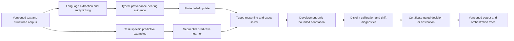

# A Component-Wise Training Protocol for the XAI Architecture

**Research methodology paper**
**Scope:** prospective training, data, calibration, and evaluation protocol for a modular system combining language-to-fact mapping, provenance-aware belief updating, sequential prediction, bounded adaptation, finite symbolic reasoning, and certificate-gated decisions.

## Abstract

This paper specifies how a future XAI system should be fitted and evaluated as a composition of distinct computational components. The proposed system is not optimized through one end-to-end loss. Natural-language interpretation, entity linking, source-reliability estimation, task-specific prediction, and—where justified—calibration have separate targets and data boundaries. Factual belief updating, exact finite reasoning, solver execution, decision gating, and orchestration are governed by explicit mathematical rules and validated inputs rather than being treated as unconstrained trainable parameters.

For broad English-language understanding and factual acquisition, the shared raw corpus may target at least 1 GiB of uncompressed text and structured records, paired where possible with independently adjudicated annotations. An English Wikipedia export aligned to a dated Wikidata dump is one such corpus. That size target does **not** apply separately to every module: solver outcomes, calibration examples, development cases, rule-reasoning tasks, and software-verification fixtures are task-specific and may be much smaller. The paper identifies a concrete dataset and a distinct fitting or verification procedure for each component.

**Keywords:** modular learning; factual ingestion; entity linking; Bayesian evidence; weighted model counting; online prediction; selective prediction; calibration; data provenance.

## 1. Objective and formal scope

The objective is to develop a versioned system that maps a bounded set of observations and tasks into typed claims, updates explicit beliefs from admissible evidence, performs supported reasoning, and either emits a justified result or abstains. The term *training* refers here to the entire controlled development lifecycle: fitting selected statistical modules, estimating declared evidence parameters, selecting bounded development settings, calibrating forecasts where data permit, and evaluating the frozen composition. It does not imply that every module has trainable weights.

Let the versioned system state be

\[
S_t=(X_t,E_t,G_t,\Pi_t,M_t,A_t,C_t,D_t,O_t),
\]

where \(X_t\) is the language-to-structure state, \(E_t\) the immutable evidence ledger, \(G_t\) the finite probabilistic fact state, \(\Pi_t\) the predictive learner, \(M_t\) the typed reasoning task, \(A_t\) the bounded adaptation state, \(C_t\) calibration and shift diagnostics, \(D_t\) the decision and certificate state, and \(O_t\) the orchestration and provenance record. Every persisted state is bound to schema, code, data, configuration, and partition identifiers.

The intended architecture has no shared optimizer spanning these states. Each component has an explicit target, an allowed data partition, a stopping or freeze rule, and a failure status. This separation is necessary because a statistical forecast, a source likelihood, an exact solver result, and an action policy are different objects with different validity conditions. The component interfaces and finite-world semantics follow the repository’s shared contracts and end-to-end specification; the present document defines how a future empirical training lifecycle should use them.



The diagram describes responsibility, not a mandatory path for every request. A run must state which stages were executed, skipped, or rejected and why.

## 2. Data specification and example corpus

### 2.1 Source package and minimum size

There is **no universal 1 GiB minimum for each component**. The 1 GiB target is for a broad shared raw corpus when the objective includes corpus-scale language and factual acquisition. Measure it as uncompressed, retained text and structured records after excluding indexes, caches, duplicates, and model artifacts. Task-specific supervised or evaluation datasets may be smaller when their size is appropriate to the target and their uncertainty is reported. Every dataset manifest shall record compressed and uncompressed bytes, record counts, snapshot dates, source URLs, per-file SHA-256 hashes, parsers, licenses, and transformations. Corpus volume alone does not establish representativeness or adequate supervision.

A concrete English-language starting corpus is:

1. **English Wikipedia content:** one frozen, per-wiki MediaWiki Content File Export containing page source and metadata. Wikimedia identifies these compressed XML exports as unparsed public-wiki content and provides separate current and historical content collections; the content-export documentation is available at [MediaWiki Content File Exports](https://dumps.wikimedia.org/other/mediawiki_content_history/readme.html). The export is used as source text, not as ground-truth labels.
2. **Wikidata structured entities:** one dated full JSON entity dump, aligned to the same collection window. Wikidata’s database-download documentation describes JSON as the recommended stable dump interface and states that entity objects can be processed line by line; the [entity-dump index](https://dumps.wikimedia.org/wikidatawiki/entities/) lists snapshot files and sizes. The index consulted on 7 October 2026 listed `latest-all.json.bz2` at 103,337,856,107 bytes. A reproducible acquisition must use and record a dated snapshot directory rather than relying on the moving `latest` alias. Prefer the full JSON representation where qualifiers and reference metadata are needed; Wikidata documents that its smaller “truthy” RDF dumps omit qualifiers and references.
3. **Adjudicated alignment records:** a separately versioned annotation set linking selected text spans to entity IDs, relation identifiers, polarity, temporal qualifiers, and evidence provenance. Such annotations must be authored or independently reviewed; they must not be presumed to exist merely because Wikipedia and Wikidata are downloaded together.

This combination can satisfy the broad-corpus data-volume target through structured data alone at the cited snapshot size and supplies both natural-language observations and machine-readable fact candidates. Before a run, the exact snapshot sizes must be rechecked and an acquisition manifest frozen. This shared corpus is not a mandatory input to every component: for example, exact solver verification uses small formula/oracle pairs, while calibration uses a held-out set from the task being calibrated. The corpus must not include images or other media unless a separately scoped multimodal task is defined and its licenses and labels are handled independently.

Wikimedia’s licensing guidance states that text is generally available under GFDL and/or CC BY-SA 4.0, with exceptions, while structured data in Wikidata’s main, Property, Lexeme, and EntitySchema namespaces is dedicated under CC0. The corpus manifest must preserve applicable attribution, source/revision metadata, and any item-specific license exceptions; consult the [official dump licensing guidance](https://dumps.wikimedia.org/legal.html) and the controlling terms for the chosen release. This protocol is not legal advice.

### 2.2 Record schema and worked example

A training example for language extraction and fact grounding should preserve at least:

```json
{
  "observation_id": "obs:wiki:en:page:example:revision:example",
  "source_id": "source:enwiki:example",
  "source_uri": "https://en.wikipedia.org/wiki/Example",
  "snapshot_id": "wikimedia-snapshot:YYYYMMDD",
  "revision_id": "revision-id",
  "text_span": "Paris is the capital of France.",
  "mention_spans": [
    {"text": "Paris", "begin": 0, "end": 5, "entity_id": "Q90"},
    {"text": "France", "begin": 25, "end": 31, "entity_id": "Q142"}
  ],
  "assertion": {
    "subject_id": "Q142",
    "predicate_id": "P36",
    "object_id": "Q90",
    "polarity": "positive",
    "valid_time": null
  },
  "review": {"status": "adjudicated", "annotation_schema": "xai.claim-v1"},
  "partition": "training"
}
```

The example is illustrative rather than a claim that the text span occurs in a particular revision. An aligned record shall retain the original page and revision reference, text offsets, source identity, annotator protocol, and schema version. The statement `(Q142, P36, Q90)` is a canonical proposition identifier for “France has capital Paris”; an implementation may map it to a Boolean `FactId` plus a separately versioned proposition payload. It must not silently assume that a triple, its qualifiers, and its provenance are represented by one untyped text string.

Annotations should include positive assertions, negation, uncertainty, temporal change, aliases, ambiguous mentions, contradictory reports, and hard negatives. For example, mention of “Paris, Texas” is a hard negative for linking a bare “Paris” mention to Q90 when the local context identifies the Texas city. At least a sample of training labels should be double-annotated and adjudicated; agreement statistics and adjudication rules must be reported.

### 2.3 Partitions, leakage controls, and non-results

The data manager shall construct disjoint `training`, `development`, `calibration`, and `final_test` partitions before fitting or parameter selection. `streaming` data, if authorized, is a separate post-freeze policy and is not retroactively added to the training set. Partition membership shall be frozen in a manifest and validated against page/revision IDs, entity clusters, source families, duplicate text, and near-duplicate text.

For extraction and entity linking, the primary test should include page or entity clusters absent from training, with a temporal holdout where the task concerns changing facts. A second, clearly labeled in-domain test may measure performance on known entities but must not replace the entity-disjoint result. For WMC completion prediction, formulas and isomorphic/near-duplicate families must not cross partitions. Where the number of examples is too small to support all four roles, the protocol shall reduce the number of claims or acquire more labels rather than reusing final-test outcomes for tuning.

Missing, malformed, unresolved, out-of-scope, or externally interrupted examples are not negative labels. Each component shall distinguish a true observed negative from a `non_result`, `unknown`, or `unsupported_input` status. No preprocessing step may remove such records from the audit trail merely because they cannot contribute to a particular loss.

## 3. Component-specific training and fitting procedure

#### Component-by-component map

“Training” below means changing a statistical parameter or sufficient statistic using an authorized target. A component that has no fitted parameters is developed through validation, benchmark comparison, or explicit policy specification—not described as trained.

| Component | What it does | How it is fitted or validated | Recommended dataset and size rule |
|---|---|---|---|
| Language understanding and grounding | Maps a bounded text span to entity mentions, typed relations, polarity, and time. | Fit a finite-state tagger, alias/candidate ranker, and/or constrained relation-pattern weights on adjudicated labels; abstain on ambiguity. | English Wikipedia text plus Wikidata labels/aliases for candidate generation; add a project annotation set of sentence spans and typed claims. No 1 GiB requirement for the labeled examples; the shared raw corpus may meet that target. |
| Factual ingestion and evidence reliability | Turns accepted claims into provenance-bearing factors and updates finite fact beliefs. | Belief state is updated mathematically, not by an end-to-end corpus loss. Estimate source sensitivity/false-positive likelihoods only from a separately adjudicated audit set. | [FEVER](https://fever.ai/dataset/fever.html) supplies 185,445 support/refute/not-enough-information claims with evidence for evidence-grounding experiments; it does **not** measure publisher reliability. A source-reliability audit is task-specific and need not be 1 GiB. |
| Predictive learning | Forecasts a named outcome, such as exact WMC completion under a fixed resource budget. | Use the fixed expert library and predict–score–update on eligible training outcomes; never update on development, calibration, or final-test data. | [2024 MCC Track 2 WMC instances](https://mccompetition.org/2024/mc_description.html), with labels generated by a frozen solver protocol. The Track 2 task set is small; no 1 GiB minimum applies. |
| Reasoning and exact solver | Computes answers from explicit finite variables, weights, constraints, and queries. | The solver itself is not statistically trained; test against exhaustive oracles. If language-to-rule grounding is learned, fit that adapter on separate labeled input/output pairs. | [ProofWriter](https://aclanthology.org/2021.findings-acl.317/) for natural-language rule/query grounding and proof checks; MCC Track 2 for weighted counting. Small exact-oracle fixtures are appropriate. |
| Bounded adaptation | Selects from a finite set of approved settings and restores a baseline on defined failures. | Evaluate each candidate on development cases only; select under a frozen objective, limits, tie-break, and rollback rule. | A development partition of the same MCC WMC task, with results collected for each candidate setting. The development set is task-sized, not a 1 GiB corpus. |
| Calibration and uncertainty | Measures probability quality, selective risk, and assumption-gated set coverage. | Evaluate the frozen predictor on disjoint calibration cases; fit a separate calibrator only if explicitly specified. | Hold out labeled records from the exact target dataset being calibrated (e.g., WMC outcomes or claim labels). Size is set by required precision/coverage uncertainty, not raw bytes. |
| Decision, certificate, and output | Chooses an admissible action or abstains; verifies required certificates and renders structured results. | Do not fit the loss policy to final-test answers. Elicit or declare losses/costs; independently verify certificates; evaluate the fixed policy on scenarios. | A small, domain-specific scenario and loss table is required; there is no universal generic training corpus. Use exact input/result/proof pairs to test a verifier. |
| Orchestration and shared contracts | Enforces stage order, schemas, partitions, provenance, limits, and fail-closed statuses. | No statistical fitting. Validate with unit, integration, replay, invalid-input, and resource-limit tests. | Synthetic and hand-authored contract fixtures, such as the repository’s `TESTS/cpp/*_tests.cpp`; no corpus-size requirement. |

### 3.1 Language interpretation and typed grounding

The language front end shall be trained as a bounded, separately versioned adapter, not by fitting the entire architecture jointly. For an initial non-neural implementation, a feasible target is English sentence segmentation, mention-span detection, entity candidate ranking, and extraction of a closed set of relation types into typed propositions. A finite grammar, alias index, and feature-based statistical sequence model may be combined; each accepted extractor output must include a confidence or ambiguity status, source span, extractor version, and candidate entities. The model shall abstain where a mention or relation is ambiguous or outside the declared schema.

For a finite-state sequence tagger, for example, estimate transition and emission probabilities from adjudicated token labels with declared smoothing constants \(\alpha\):

\[
\widehat P(s\mid s')=\frac{N(s',s)+\alpha}{N(s')+\alpha |\mathcal S|},\qquad
\widehat P(w\mid s)=\frac{N(s,w)+\alpha}{N(s)+\alpha |\mathcal V|}.
\]

A constrained decoder then selects the most probable legal sequence. Entity linking may rank candidates \(e\) using

\[
P(e\mid m,c,\tau)\propto P(m\mid e)P(c\mid e)P(\tau\mid e)P(e),
\]

where \(m\) is the mention, \(c\) its context, and \(\tau\) any type constraints. Candidate priors, alias counts, context features, and smoothing are fitted only on `training`; score-to-confidence mapping is assessed separately on `calibration`. Rule or grammar edits informed by `development` must be frozen before final testing. If a later design adds a neural parser or generative language model, that is a separately specified architecture change with its own data, compute, safety, and validation plan; it must not be implied by this non-neural protocol.

The extraction dataset should be evaluated at span, entity, predicate, polarity, and full-claim levels. Exact match on the full typed assertion is essential: a correct entity with an incorrect relation or time is not a correct fact. Report micro- and macro-averaged precision, recall, and F1, entity-linking accuracy at top-1 and top-k, calibration of confidence, and risk-versus-coverage under abstention. Evaluate by relation, entity frequency, ambiguity, time expression, and source type where sample sizes permit.

**Recommended dataset.** Use the English Wikipedia content export and a dated Wikidata JSON dump as the text and entity/alias inventory. These are largely unlabeled for the extraction target, so create a smaller adjudicated annotation set of spans and complete typed claims. FEVER can supplement claim/evidence tasks, but it is not a substitute for token-span or entity-linking labels. Split by page/entity clusters so near-duplicate biographies and repeated entity mentions do not leak across train and test. The text/knowledge archive can exceed 1 GiB; the hand-labeled examples do not need to.

**Initial KILT T-REx experiment.** The prepared `tools/grounding_train.py` utility uses the selected KILT T-REx KILT-format release (2,284,168 train, 5,000 dev, and 5,000 answer-withheld test rows) for an exact subject-alias/relation-label slot-filling baseline. Its input is `subject [SEP] relation`, and its targets are answer surface forms; the release does not provide sentence-level mention spans or stable Wikidata entity/property IDs in these KILT rows. Thus this experiment can evaluate relation-aware surface-form ranking, but it is not a general language extractor, QID linker, or factual verifier. Entity-ID grounding needs an additional versioned mapping/annotation source. Use dev for labeled evaluation; test remains answer-withheld. The script's preflight records byte counts and SHA-256 values before the separate `train` command is explicitly invoked.

**Reusable sharded trainer (implementation only; no run implied).** `tools/trainer.py` separates `plan`, `train-shard`, and `merge`; `tools/trainer_hub.py` handles the Hugging Face Hub handoff. The manual GitHub Actions workflow schedules 20 independent matrix jobs, each building one SQLite model index from its own disjoint shard. Planning makes balanced, contiguous, non-overlapping ranges over the frozen training JSONL and records per-shard byte counts and SHA-256 hashes. The final merge requires all 20 worker models and verifies their run-manifest and shard lineage. The production lifecycle has no evaluation stage: merge synthesizes the full model without scoring or evaluating individual shard models.

This merge is mathematically valid for the current component because the learned state is a set of raw occurrence-count sufficient statistics. For every normalized subject/relation/answer key, merging sums the disjoint shard counts in source-range order; it therefore reproduces the same candidate counts and first-seen surface choice as one serial pass over the full file. These are not neural parameter weights, and this merge rule must not be reused for gradient-trained/non-convex models without an explicitly justified merge algebra. The ranges guarantee that each source record occurs in exactly one shard; they do not silently deduplicate any pre-existing repeated records in the source dataset.

**GitHub Actions runs the 20 workers; Hugging Face Hub is the handoff store.** The manual-only workflow is [`.github/workflows/trainer.yml`](.github/workflows/trainer.yml). GitHub standard-runner minutes are free/unlimited for public repositories, but that does not mean an individual job can run without interruption: GitHub's [Actions limits](https://docs.github.com/en/actions/reference/limits) cap each hosted job at six hours and list 20 concurrent standard jobs on Free. This workflow sets `max-parallel: 20` and a 360-minute timeout. Standard public Ubuntu runners are documented as 4 CPUs, 16 GB RAM, and **14 GB SSD total** ([runner specs](https://docs.github.com/en/actions/reference/runners/github-hosted-runners)); if all 20 start together, these are 20 independent runners (up to 80 runner CPUs total), not a shared-memory training cluster. Other workflow activity can consume concurrency and cause jobs to queue.

No GitHub Actions artifacts are used, so this run does not depend on the GitHub Free 500 MB artifact allowance. The raw KILT T-REx train file is **1,752,330,104 bytes (about 1.75 GB decimal)**. The planner holds that file plus the complete set of shards at once, approximately 3.5 GB before checkout and runner software; the plan job fails early unless at least 6 GiB is free. Each worker downloads **only its assigned shard** (about one twentieth of the source bytes on this dataset), with a 4 GiB minimum free-space check. The merge job downloads and validates partial SQLite files one at a time and applies a conservative disk-capacity check before downloading any of them. Actual worker-model sizes are not known until training, so monitor the emitted free-space reports and treat the guards as fail-fast protections, not a guarantee that every runner disk will suffice.

The Hub still has account-level storage limits. Hugging Face's [storage policy](https://huggingface.co/docs/hub/storage-limits) says Free accounts have **100 GB of private storage**; public storage is **best-effort**, and storage across model/dataset repositories counts toward the account quota. The 1.75 GB shard set, 20 SQLite worker models, merged model, and other existing Hub content all consume storage; partial-model sizes and the account's remaining quota have not been measured by this implementation. Use an existing Hub repo of the matching type (`dataset` or `model`) and verify account capacity first. The workflow does not create repositories or change visibility. Review KILT dataset redistribution terms before using a public repo.

Before dispatch, store a write-scoped Hugging Face token as the Actions secret **`HF_TOKEN`** inside the GitHub environment named **`HF_TOKEN`**. All three workflow jobs explicitly target that environment so the secret is available; any configured environment protection or required-reviewer rules also apply. The workflow requires the existing Hub repository ID and type as dispatch inputs. For the XAI model repository, use `Nexuss0781/xai-models` with type `model`. The workflow checks token write access before downloading the dataset and never stores the token in source or prints it.

For run `<github-run-id>`, the plan branch is `trainer-<github-run-id>-plan`; it contains the manifest, 20 shard files, and final merged SQLite model under `runs/<github-run-id>/`. The matrix workers use isolated branches `trainer-<github-run-id>-worker-0000` through `...-0019` and upload their individual SQLite models there. Distinct branches avoid 20 concurrent commits contending on one Git ref. After all workers succeed, the merge job downloads each model in turn, performs the exact additive synthesis, and uploads the merged model to the plan branch. These branches are intentionally retained so the 20 partial models remain available; **there is no automatic cleanup**, so each successful run adds to Hub storage until runs/branches are manually removed. There is no evaluation or test stage in this workflow. No training run or workflow dispatch has been started as part of implementing this engine.

The local CLI remains available when a dataset is already prepared:

```sh
python3 tools/trainer.py plan --data-dir data/kilt/trex --run-dir data/kilt/trex/trainer-run --shards 20
python3 tools/trainer.py train-shard --run-dir data/kilt/trex/trainer-run --shard-index 0
python3 tools/trainer.py merge --run-dir data/kilt/trex/trainer-run --output-model models/kilt-trex-slot-filling-merged.sqlite
```

The engine bounds plans to 20 shards. The CI workflow is explicitly dispatched; merely adding it does not train or evaluate anything.

### 3.2 Factual ingestion and evidence reliability

Factual ingestion is an evidence update over explicit facts, not a language-model-style corpus loss. Each admitted assertion becomes an append-only evidence record containing evidence and source IDs, observation time, original span reference, extractor version, partition, factor semantics, dependency links, and a declared likelihood or hard constraint. The world model remains open-world: absence of an assertion means unknown unless a task explicitly supplies a prior or closed-world constraint.

Prior potentials and source likelihoods shall be versioned inputs. If the project estimates source reliability, it must use a separately adjudicated audit set, distinct from the examples used to fit extraction. For a source stratum \(s\), a simple sensitivity parameter can be estimated with a Beta prior:

\[
r_s\mid D_s\sim\operatorname{Beta}(a_s+c_s,b_s+n_s-c_s),
\]

where \(n_s\) is the number of adjudicated source assertions and \(c_s\) the number correct under a predeclared matching rule. Analogous parameters are required for false-positive rates, relation-specific reliability, and relevant selection effects. Source-level clustering must be accounted for; copied or syndicated reports must not be counted as independent observations. Posterior means alone are not sufficient when uncertainty is material; the run must declare whether it uses posterior predictive likelihoods, conservative intervals, or abstention.

For a report \(e\) with declared sensitivity \(r\) and false-positive probability \(f\), the likelihood factor for a binary fact \(X\) may be

\[
L(e\mid X=1)=r,\qquad L(e\mid X=0)=f.
\]

With prior potentials \(w(0),w(1)\), the updated marginal is obtained from the finite joint model, not from an unrecorded confidence heuristic. Independent factors may be multiplied only when independence is explicitly justified. Exact duplicates are retained for provenance but multiplied once; correlated or unknown dependence requires a joint model or an `unsupported_input` result. Conflicts remain visible as posterior uncertainty or inconsistency; they are not silently resolved by majority vote.

Where finite facts \(X_1,\dots,X_n\) and evidence factors \(L_j\) are supported, the finite model is

\[
W(x)=\prod_i w_i(x_i)\prod_j L_j(x_{S_j}),\qquad
P(X_k=1\mid E)=\frac{\sum_{x:x_k=1}W(x)}{\sum_x W(x)}.
\]

Every reported marginal must carry the evidence lineage, normalization status, exactness or approximation status, resource status, and limits. A corpus fact is not true merely because it occurs in the source dump; the source, extraction, dependence, and world-model assumptions remain explicit.

**Recommended dataset.** Use FEVER’s labeled claims and annotated evidence to test support/refutation/insufficient-evidence handling and claim-to-evidence alignment. Because FEVER labels claims against Wikipedia rather than estimating the reliability of publishers, estimate source-specific likelihoods from a separate, stratified, human-adjudicated audit in the intended domain. The audit should include source identity, claim type, time, duplicates, and dependencies; it can be a modest record-level set and has no 1 GiB requirement.

### 3.3 Predictive learning

Predictive models shall be trained only for a named outcome. A suitable initial target is whether an eligible, parser-valid weighted CNF instance receives an exact solver result within fixed resource limits. Features available at prediction time may include declared structural quantities such as variable count, clause count, and literal-occurrence count. Solver status, runtime, node count, or other post-run measurements are labels or diagnostics and must not leak into the feature vector for that same prediction.

For the architecture’s finite predictive library, let expert \(h\) produce \(p_{h,t}(y_t)\) and let \(w_{h,t}\) be its prior mixture weight. Predict before observing the target:

\[
q_t(y_t)=\sum_h w_{h,t}p_{h,t}(y_t),\qquad
w_{h,t+1}=\frac{w_{h,t}p_{h,t}(y_t)}{q_t(y_t)}.
\]

The initial WMC completion library may consist of (i) a global Beta–Bernoulli model, (ii) a structural-context Beta–Bernoulli model, and (iii) a previous-outcome Beta–Bernoulli model, with the library, feature schema, priors, and update order frozen before the authorized sequence. For each example the required order is **predict → score → update**. Only trustworthy outcomes from `training` or explicitly authorized `streaming` records may update sufficient statistics. `development`, `calibration`, and `final_test` are read-only; malformed or externally interrupted runs are `non_result`, not solver noncompletion.

The log-loss mixture guarantee is relative to the fixed declared library and prior; it is not an absolute accuracy or generalization guarantee. Report prequential log loss and Brier score, class prevalence, uncertainty, subgroup/time behavior, missing outcomes, and every exclusion. Text-corpus size alone does not supply WMC outcome labels. Solver outcomes must be collected under a separate, frozen execution protocol and exact oracle where feasible; the Wikipedia/Wikidata corpus shall not be presented as a substitute for task labels.

**Recommended dataset.** Use the public Track 2 weighted-CNF instances from the [2024 Model Counting Competition](https://mccompetition.org/2024/mc_description.html), then create completion labels by running the declared solver and resource limit on the training/development partitions. The [Zenodo full-instance record](https://zenodo.org/records/14969231) reports a 1.2 MB Track 2 collected archive and a 1.2 GB Track 2 bonus archive; the bonus includes negative weights, so include it only if the selected parser, weight contract, and task explicitly support those cases. Do not download a larger variant merely to satisfy a byte threshold. The predictor needs enough independent labeled formulas for a credible estimate, not a gigabyte of raw data.

### 3.4 Reasoning, rule construction, and exact solving

The finite reasoning module is not trained by imitation of answer strings. Each supported task is encoded as typed variables, finite domains, constraints, evidence assignments, weights, and queries. Any mapping from annotated text or a factual graph into a reasoning task is itself a versioned grounding procedure and must be evaluated on gold structured representations before solver results are assessed.

For hard constraints \(H\), evidence \(E\), query \(Q\), and nonnegative weights \(w\), exact weighted reasoning returns

\[
Z(E)=\sum_{x\models H\land E}\prod_i w_i(x_i),\qquad
P(Q\mid E,H)=\frac{Z(E,Q)}{Z(E)}
\]

when \(Z(E)>0\). Rules may be authored from a declared schema or proposed from training annotations, but learned rule candidates must pass type checking, independent validation, and (where a formal property is claimed) a sound verifier. Final-test examples must not be used to invent predicates, choose constraints, revise a grounding map, or select a solver. Unsupported grounding, non-identification, zero normalization, timeout, and resource exhaustion must remain explicit statuses; they are not converted into a plausible answer.

The parser, exact WMC engine, finite-domain enumerator, schema validators, and independent certificate checker are algorithmic or verification components, not statistically fitted models. Their training analogue is software verification and benchmark testing: cross-check small cases against independent exhaustive enumeration, validate exact rational arithmetic, test malformed and limit cases, and report exact-result agreement and resource use. Exactness is conditional on the encoded model and correct execution; it does not validate the real-world truth of the premises.

**Recommended dataset.** Use ProofWriter’s natural-language facts, rules, questions, and proof-oriented labels to evaluate a bounded text-to-rule/query grounding adapter and multi-step deduction. Use MCC Track 2 instances for exact weighted-model-counting behavior. For solver correctness, small generated CNF/factor cases with independently computed exhaustive answers are the primary oracle set; the large text corpus is not relevant to that verification target. ProofWriter tests logical deduction over its synthetic rule worlds and must not be presented as evidence of factual knowledge about the real world.

### 3.5 Bounded adaptation and change monitoring

Adaptation shall be constrained configuration selection, not unrestricted self-modification. Define a finite candidate set \(\Omega\), a baseline \(\theta_0\), and a development objective \(J(\theta;D_{dev})\) before inspecting development outcomes. For the WMC example, \(\theta\) may be a declared solver node cap chosen from a fixed grid; the objective may be the number of exact completions, with a deterministic tie-break. Every candidate evaluation must be within declared resource limits and must be checked against an exact oracle where available.

A simple deterministic procedure is

\[
\theta^*=\arg\max_{\theta\in\Omega}J(\theta;D_{dev}),
\]

subject to invariant checks, hard resource bounds, and a rollback rule that restores \(\theta_0\) on objective regression, invariant failure, solver failure, or a predeclared shift alarm. The complete candidate ranking and state transitions are logged. The calibration and final-test partitions never enter candidate ranking. Streaming observations may trigger monitoring and rollback only under a separately authorized policy; they are not repurposed as development data. Detector thresholds and distributional assumptions require independent validation and must not be described as guaranteed false-alarm rates without such evidence.

**Recommended dataset.** Reuse only the `development` partition of the selected WMC benchmark and run every candidate setting on those same cases. The candidate-by-case results—not the Wikipedia/Wikidata source corpus—are the adaptation data. Because the setting set is finite and each case is evaluated repeatedly, the dataset may be much smaller than 1 GiB; report the number and diversity of formulas and the uncertainty caused by a small suite.

### 3.6 Calibration and selective prediction

After model selection is frozen, the calibration component shall assess predictions on a disjoint `calibration` set. Report proper scores, including

\[
\operatorname{BS}(p,y)=(p-y)^2,\qquad
\operatorname{LS}(p,y)=-y\log p-(1-y)\log(1-p),
\]

as well as reliability bins, sample counts, subgroup summaries, sharpness, risk-versus-coverage, and detected shift indicators. If a calibration transformation is introduced, it must be a separately versioned mapping fitted only on the calibration partition; it cannot be silently folded into the predictive learner after final-test inspection.

For binary split conformal prediction, with calibration nonconformity scores \(R_1,\dots,R_n\), use the order-statistic index

\[
k=\left\lceil(n+1)(1-\alpha)\right\rceil.
\]

A coverage statement is permitted only when the stated exchangeability conditions are defensible for calibration and future observations. The claim is marginal, not a guarantee for each subgroup. Under small samples, empty bins, missing labels, or detected distribution change, report the limitation and allow the policy to abstain rather than implying reliability. Calibration diagnoses forecast behavior; it does not make an inaccurate factual representation correct.

**Recommended dataset.** There is no standalone universal calibration corpus. Reserve a disjoint, labeled sample from the same task-specific dataset: WMC completion outcomes for the completion predictor, FEVER claim labels for an evidence classifier, or adjudicated extraction records for extractor confidence. Do not pool incompatible targets into one calibration set. The necessary sample count depends on the desired interval width and coverage level; bytes on disk are not the relevant criterion.

### 3.7 Decision, certificate, and output policy

The decision component shall use a predeclared action set, state space, loss matrix, resource cost, and abstention cost. These are policy inputs—not parameters to be inferred from final-test success. Given belief \(p(s)\), action loss \(L(a,s)\), resource cost \(c(a)\), and abstention cost \(\rho\), choose among admissible actions by

\[
R(a)=\sum_s p(s)L(a,s)+\lambda c(a),\qquad
 a^*=\arg\min_{a\in\{\bot\}\cup\mathcal A_{\mathrm{cert}}}R(a),
\]

where \(\bot\) denotes abstention and \(\mathcal A_{\mathrm{cert}}\) contains only actions with valid required certificates. State probabilities, costs, and loss values must have named provenance and be elicited or estimated using a separate, justified protocol. Sensitivity analysis should show whether reasonable alternative losses change the selected action.

An exact-result action requires an independent verifier for the declared property, bound to the exact input and result. The verifier’s proof format, soundness assumptions, implementation version, and resource limits must be specified. A certificate’s existence is not a substitute for verifying it, and a valid certificate establishes only its encoded property. The output layer should render structured results deterministically with assumptions, evidence lineage, version identifiers, exactness, resource status, and uncertainty. Free-form natural-language generation is outside this protocol; if added, it requires a separate grounded-generation target and evaluation protocol.

**Recommended dataset.** No generic text dataset can determine action costs or user losses. Construct a compact, domain-specific scenario table with states, candidate actions, expert-elicited losses, resource costs, and the rationale for each value; evaluate the frozen policy on held-out scenarios and sensitivity analyses. For certificate verification, use input, claimed exact result, and independently checked proof triples, including invalid and adversarial cases. Neither set needs to be 1 GiB.

### 3.8 Orchestration and shared contracts

Orchestration has no statistical training target. It validates stage order, data partitions, schemas, resource budgets, version compatibility, and permitted feedback. Every run records each stage as executed, skipped, or failed with a reason, and links outputs to source, evidence, model, configuration, and code hashes. State restoration, if introduced, must verify schemas and hashes before replay; partition labels must be protected by the surrounding data system because a caller-supplied label alone is not authentication.

Shared contracts, parsers, serializers, and validators are likewise specified and tested rather than fitted. Their acceptance criteria include canonical serialization, schema compatibility, explicit error statuses, limits, deterministic replay under a pinned runtime, and rejection of invalid or untrusted records. No module may convert `unknown`, `unsupported_input`, `inconsistent`, `timeout`, `resource_limit`, or `certificate_rejected` into a default confident value.

**Recommended dataset.** Use deterministic hand-authored and synthetic records covering valid inputs, every failure status, partition violations, duplicate IDs, resource limits, serialization round-trips, and replay. The repository’s component and orchestration test fixtures are an appropriate starting test set. These are software test cases, not a machine-learning corpus, and should remain small enough to run routinely.

## 4. End-to-end protocol

The proposed lifecycle is the following fixed sequence:

1. **Freeze the claim and task.** Name each target population, supported language and schema, labels, outcome timing, solver/resource limits, allowed claims, baselines, metrics, and stopping rule.
2. **Acquire and inventory the corpus.** Pin dated source snapshots, preserve license and revision metadata, verify bytes and hashes, record the expanded volume, and remove or quarantine corrupt, duplicate, or out-of-scope records without erasing their audit counts.
3. **Create and adjudicate labels.** Define the annotation manual, sample by source/entity/relation/ambiguity strata, use independent annotators for a measured subset, adjudicate disagreement, and version all label changes.
4. **Group and partition.** Split by page, entity, source family, duplicate cluster, and—where appropriate—time before fitting. Freeze IDs and hashes for training, development, calibration, and final test.
5. **Fit the language adapter.** Fit its finite vocabulary, transitions, candidate priors, and relation patterns on training annotations only. Select thresholds and bounded rule choices on development; reserve calibration for confidence diagnostics.
6. **Estimate evidence parameters.** Use a distinct adjudicated source-reliability sample. Specify dependence relations and priors; freeze the likelihood model and open-world policy.
7. **Fit predictive targets.** Collect task-specific outcomes under a fixed protocol and process eligible training examples in declared order using predict–score–update. Do not treat factual source text as solver outcome data.
8. **Select bounded adaptation.** Search only the finite predeclared configuration set on development data, check oracles and invariants, and log rollback decisions.
9. **Calibrate and freeze.** Evaluate the frozen predictors on calibration data, fit only any predeclared separate calibration mapping, and freeze all component, schema, threshold, rule, and policy versions.
10. **Evaluate once on final test.** Execute the locked protocol read-only. Report all task-specific metrics, failures, abstentions, resource use, subgroup results, and uncertainty. After any material change, use a new untouched test set for a confirmatory claim.
11. **Optionally authorize streaming.** Treat streaming as a new versioned operating mode with explicit label authority, temporal order, monitoring, audit, and rollback policy; never resume ordinary training by silently importing final-test outcomes.

## 5. Evaluation plan and reporting standard

Evaluation shall distinguish component validity from complete-pipeline validity. A favorable end-to-end score cannot identify which stage is responsible; a strong isolated score does not establish composition quality. Report, at minimum:

- **Language and grounding:** span, entity, predicate, polarity, temporal, and complete-claim scores; entity-disjoint and time-sliced results; abstention coverage and selective error.
- **Evidence model:** source-stratified sensitivity and false-positive estimates, posterior predictive checks where applicable, dependence audits, calibration of belief probabilities, inconsistent and unsupported-input counts, and exact replay checks on finite fixtures.
- **Predictive learner:** prequential and held-out log loss and Brier score, base rate, calibration diagnostics, shift behavior, and all non-results separately.
- **Reasoning and solvers:** exact agreement against independent oracles, satisfiable/unsatisfiable and zero-weight distinctions, exact completion count, timeout/resource-limit counts, and CPU/memory use. Compare with appropriate established baselines under the identical protocol.
- **Adaptation:** baseline-versus-selected objective, candidate evaluation count, resource cost, alarm/rollback frequency, and performance after freezing. Include ablations that remove adaptation and other claimed components.
- **Calibration and decisions:** proper scores, reliability-bin counts, conformal sample count and assumptions, risk-versus-coverage, decision utility under declared losses, abstention rate, and certificate acceptance/rejection results.
- **Orchestration:** stage completion/skip/failure counts, schema and partition violations, deterministic semantic replay, and provenance completeness.

Ablations shall remove one component at a time while retaining the same data, candidate budget, resource limits, and evaluation protocol. Baselines and metrics must be named before final-test access. Report confidence intervals or other uncertainty summaries appropriate to each unit of analysis; page-, entity-, source-, or formula-level dependence must be reflected in resampling or inference. Include a negative or null result without changing the test set or metric after the fact.

The final report must identify each fitted component, its exact target and training data, partition hashes, model and prior versions, accepted/excluded record counts, hyperparameters or finite candidate set, software/runtime versions, computational resources, final metrics, uncertainty, and claim boundary. A result for one predictor or one dataset must not be described as evidence that the full architecture has learned unrestricted language, absorbed all facts, or generalizes to unseen domains.

## 6. Compute and reproducibility envelope

For the full corpus example, a planning configuration is a CPU-oriented node with **64 CPU cores, 512 GiB RAM, and approximately 8 TiB of high-throughput NVMe workspace**, plus separate durable storage for original archives, manifests, annotations, and versioned outputs. This is a preflight target, not a guarantee that every snapshot or index fits. Before acquisition, estimate compressed and uncompressed sizes from a representative sample, include intermediate indexes and checkpoints, and expand storage before the measured requirement exceeds capacity. Process line-oriented entity dumps in bounded batches and retain only task-required derived indexes. Preprocessing workers may operate in parallel; sequential online updates and the repository’s exact WMC solver remain separately bounded workloads.

No GPU is required for the proposed finite-state, count-based, exact-inference, or solver components. A GPU does not remove the worst-case exponential cost of exact inference. If a neural language model is selected later, that constitutes a material architecture change: document the model family, token budget, accelerator memory, training objective, dependency and license review, and additional evaluation before including it in a resource estimate or system claim.

Reproducibility artifacts shall include the acquisition manifest, archive and transformed-data hashes, partition manifest, annotation schema and adjudication manual, code/build fingerprint, compiler and numeric-runtime details, model and prior hashes, random seeds where used, configuration, resource limits, evaluation scripts, and canonical result records. Randomized procedures must use recorded seeds; floating-point algorithms must declare tolerances. Raw restricted or licensed source records shall be stored under appropriate access and retention controls; ordinary logs should contain identifiers and hashes rather than full text or personal information.

## 7. Scope of claims

Under this protocol, “trained” must always be qualified by component, task, data snapshot, label definition, and evaluation population. Exact symbolic inference is exact only relative to the supplied finite model; source likelihoods remain assumptions unless independently validated; calibration claims require their stated sampling assumptions; adaptation is bounded by its candidate set; and certificates are limited to properties actually checked by a sound verifier. A corpus exceeding 1 GiB is a reproducible scale threshold, not a proof of data quality, factual absorption, general intelligence, production readiness, or broad language understanding.

## Repository specifications referenced

This protocol is designed to align with the repository’s [project description](Project.md), [shared record contracts](SPEC/CONTRACTS.md), [factual-ingestion component](SPEC/components/01-factual-ingestion.md), [predictive-learning component](SPEC/components/02-learning.md), [adaptation component](SPEC/components/03-evolution-adaptation.md), [bounded-reasoning component](SPEC/components/04-reasoning.md), [calibration component](SPEC/components/05-calibration.md), [decision and output component](SPEC/components/06-output.md), and [end-to-end orchestration component](SPEC/components/07-orchestration.md). These links define component semantics; this paper specifies the proposed future data and training lifecycle rather than making a claim about any completed training run.
